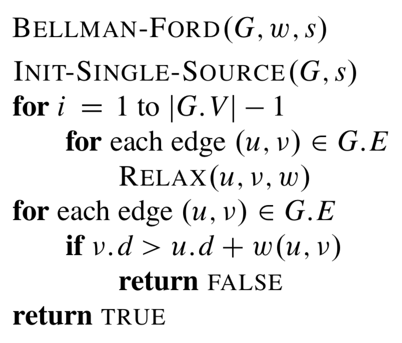
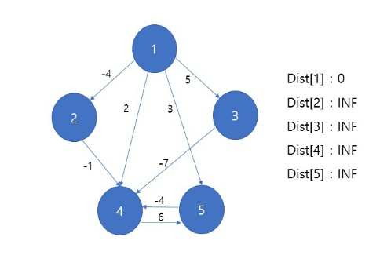
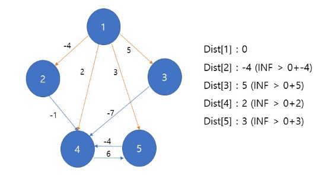
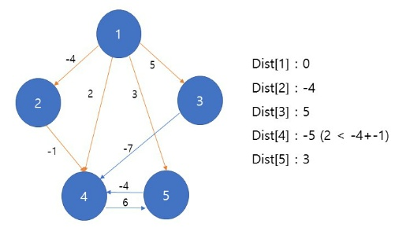

<h1>Bellman-Ford</h1>

한 노드에서 다른 모든 노드까지의 최단 거리를 구하는 알고리즘

- 음수 가중치에도 사용이 가능
- 다익스트라 알고리즘에 비해 느림
- **시간복잡도** : O(|V||E|) => V : 정점의 개수, E : 간선의 개수
  - 이 때 그래프의 간선이 많으면 보통 정점의 개수의 제곱 개 정도가 존재합니다. 따라서 E=V^2 라고 생각한다면, O(V^3)의 복잡도라고 볼 수 있습니다.

---

<h3>내용</h3>

- 시작 노드 s에서 v에 이르는 최단 경로는 s에서 u까지의 최단경로에 u에서 v 사이의 거리를 더한 값
- D(s,v) = D(s,u) + D(u,v)를 기반으로 모든 간선에 대해서 계산을 진행하여 최단 거리를 구해줍니다

---

<h3>pseudo code</h3>



- 최단경로는 순환을 포함해서는 안되므로 경로의 길이는 최대 |V|-1 입니다
- 각 정점에 대해서 정점과 연결된 모든 간선을 확인하며 __'RELAX'__를 해줍니다
- **RELAX**란 해당 정점에 대해서 더 낮은 가중치로 도달할 수 있는 경우, 그 값을 갱신해주는 것

---

<h3>과정</h3>



- 시작점을 1로 설정합니다
- 각 정점간의 거리를 저장하는 Dist 배열을 만들어줍니다
- 시작점의 거리는 0으로 놓고, 나머지 정점은 아직 탐색되지 않았다는 의미로 무한대의 수로 설정합니다.



- 시작점부터 각 간선들을 탐색하면서 업데이트되는 값이 Dist 값보다 작으면 그 값을 변경합니다.



- 2번 정점이 가지고 있는 간선에서 거리를 탐색합니다
- 나머지 정점에서도 같은 방법을 이용해서 최단거리를 수정합니다.


- 최종 결과 모습

---

<h3>구현</h3>

- 음의 가중치를 포함하고 있고, 최단 거리를 구하는 알고리즘이기 때문에 음의 cycle(순환)이 존재하는지 확인하는 과정이 꼭 필요합니다!

```python
def bellman_ford(start):
    dist=[float("inf" for i inrange(n+1))]
    dist[start]=0
    
    for i in range(n-1):
        for u,v,w in graph:
            if dist[u]!=float("inf") and dist[u]+w<dist[v]:
                dist[v]=dist[u]+v
    
    #음의 cycle 확인 과정
    cycle = 0
    for u,v,w in graph:
        if dist[u]!=float("inf") dist[u]+w<dist[v]:
            cycle=1
            break
    
    if cycle:
        print("This Graph contains negative weight cycle")
    else:
        for i in dist:
            print(i,end=' ')
```

