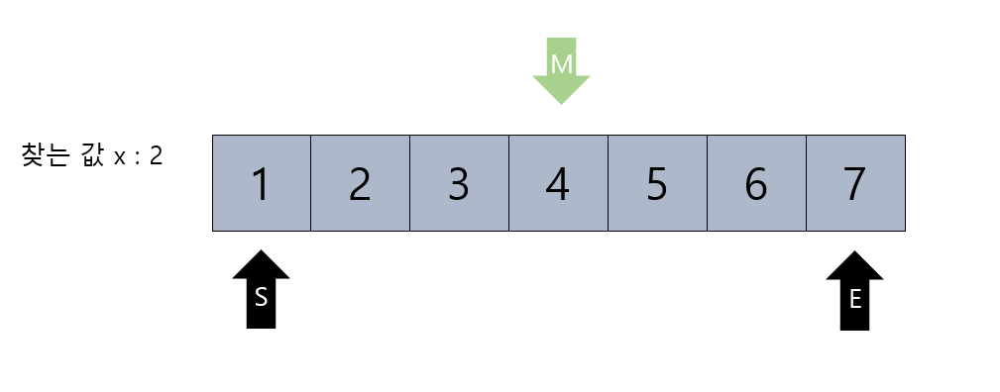
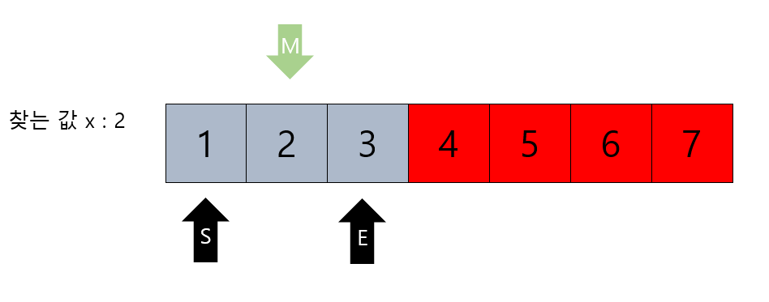
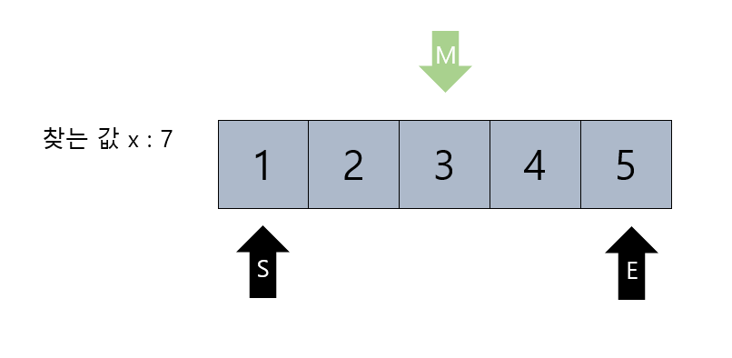
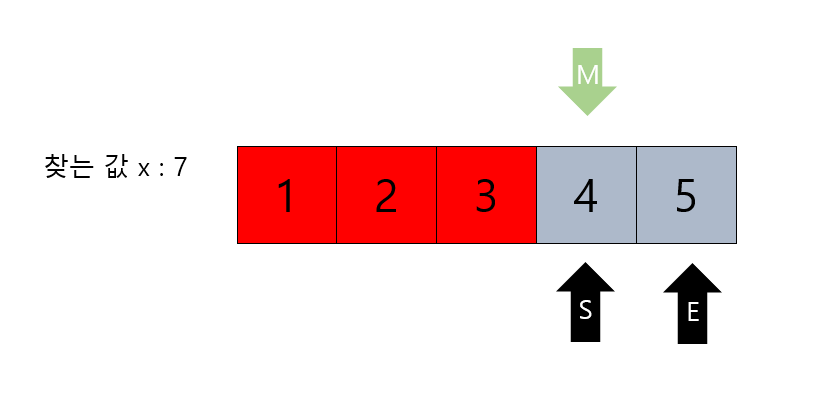
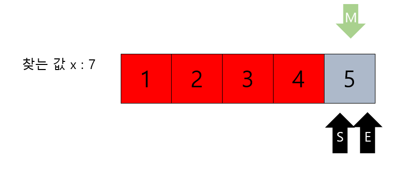
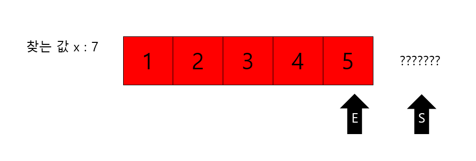
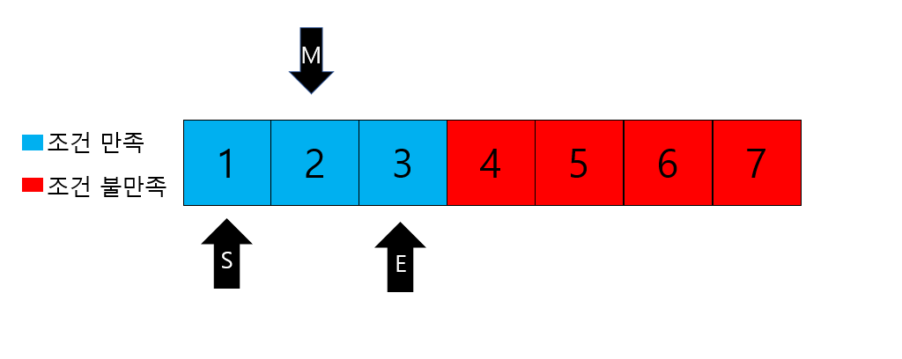
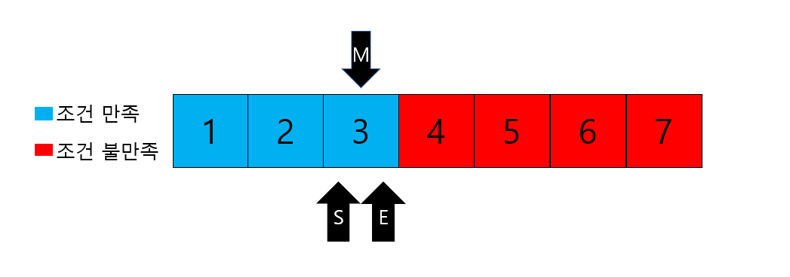

# Binary Search(이진탐색)와 Parametric Search(매개변수 탐색)

## 1. Binary Search(이진탐색)

- <strong>졍렬된 배열</strong>에서 target(찾으려고 하는 값)의 존재여부와 존재한다면 그 위치(index)를 알려주는 알고리즘 입니다.
- 여기서 포인트는 <strong>정렬된 배열에서만 사용</strong> 할 수 있다는 것 입니다.
- 그 이유는 Binary Search는 탐색 범위를 재귀적으로 반으로 줄여나가기 때문입니다.
- 시간복잡도 : O(logN)

<br>

### 1. 1)작동방식

1. 배열의 가운데 위치한 숫자와 우리가 찾는 숫자가 같은지 비교합니다.
2. 가운데 위한 숫자가 우리가 찾는 값이라면 숫자가 존재한다고(또는 그 인덱스 값을)반환하고 알고리즘을 종료합니다.
3. 만약 다르다면, 가운데 위치한 숫자와 우리가 찾는 숫자를 비교한 뒤 찾는 숫자가 더 크다면 가운데 숫자를 기운으로 배열의 윗부분에서 다음 탐색을 진행하고, 찾는 값이 더 작다면 가운데 숫자를 기준으로 배열의 아래부분에서 탐색을 진행합니다.
4. 모든 배열을 다 돌아보았지만 숫자가 없다면 찾는 숫자가 존재하지 않는 다고 반환한 뒤 알고리즘을 종료합니다.

<br>

### 1.2) 작동 예

> 정렬된 배열 [1, 2, 3, 4, 5, 6, 7]이 있습니다.
>
> S는 Start, E는 End, M은 Mid 를 의미합니다.
>
> 2가 배열에 있는지 Binary Search를 진행합니다.

#### 1. 2. a) 찾는 값이 존재하는 경우



1. M값(M=(S+End)/2)이 우리가 찾고자 하는 값 2보다 크기 때문에 M값보다 큰 숫자들을 더 이상 비교할 필요가 없어졌습니다. 따라서, E를 mid-1로 옮겨 탐색범위를 좁힌뒤에 과정을 반복합니다.



2. 다음 과정에서 M값은 찾는값 x와 같은 2에 해당합니다. 이때 배열에 X가 존재한다는 뜻의 1을 반환하거나 또는 배열에 해당하는 index를 반환하고 알고리즘을 종료합니다. 

<br>

#### 1. 2. b) 찾는 값이 존재하지 않는 경우

>정렬된 배열 [1, 2, 3, 4, 5]이 있습니다.
>
>S는 Start, E는 End, M은 Mid 를 의미합니다.
>
>7이 배열에 있는지 Binary Search를 진행합니다.



1. m(3) < x(7) 이기 때문에 start를  mid+1로 변경해줍니다.

<br>



2. 배열의 index는 정수이기 때문에  (start+end)/2 가 나우어 떨어지지 않을 경우에는 소수 부분은 버리고 몫만 가져옵니다. 이때 또한 M(4) < x(7)이기 때문에 다시 start를  mid+1로 변경해줍니다.



3. start와 mid 그리고 end가 모두 같아졌습니다. 하지만 여전히 m(5) < x(7) 이기때문에 다시 start = mid +1로 진행되어 과정이 진행됩니다.



4. 하지만 start 가 end보다 커져버리가 됩니다. start가 end보다 커졌다는 것은 배열의 범위를 뛰어넘었거나 모든 탐색할 수 있는 범위를 다 탐색을 마쳤다는 뜻입니다. 또한, 배열에 찾으려는 값이 존재하지 않는다는 것을 의미합니다. 따라서 존재하지 않음을 나타내는 0을 반환하고 알고리즘을 종료합니다.

<br>

### 1.3) Binary Search 코드 예

> 이진 탐색이 재귀적 구조를 가지는 것을 보여주기위해 재귀형태로 코드를 작성했지만 반복문을 통해서 구현하는 것이 더 좋습니다. 재귀적 구조를 사용할 떄는 파이썬에서는 최대재귀 깊이 때문에 Recursion Error가 발생할 수 있습니다. 또한, 재귀 호출을 사용하면 추가적인 공간과 시간이 사용되기 때문에 상대적으로 비효율적이라 할 수 있습니다.

```python
def binary_search(start, end, x):
	# 배열의 인덱스는 정수이기에 나누어 떨어지지 않는 경우를 위해 그 몫만 취함
	mid = (start+end)//2

	# start가 end보다 큰 경우는 배열에 찾는 값이 존재하지 않는 경우임으로 0반환
	if start > end:
		print(0)
		return
    
	# 찾는 값이 mid라면 1 반환
	if arr[mid] == x:
		print(1)
		return
    
	# 찾는 값이 mid 값보다 크다면 start 를 mid+1로 변경
	elif arr[mid] < x:
		start = mid+1
		binary_search(start, end, x)

	# 찾는 값이 mid 값보다 작다면 end 를 mid-1로 변경
	elif arr[mid] > x:
		end = mid-1
		binary_search(start, end, x)

# 탐색을 위한 정렬된 배열
arr = [1, 2, 3, 4, 5, 6, 7]
# 찾으려는 값
x = 8
# 시작 인덱스
start = 0
# 끝 인덱스
end = len(arr)-1

# 이진탐색 실행
binary_search(start, end, x)

'''
실행결과
>>> 1
'''
```

<br>

<br>

+++

## 2. Parametric Search (매개변수 탐색)

-  <strong>최적화 문제를 결정 문제롤 풀 수 있는 방법</strong>입니다.
- Binary Search 와 유사한 알고리즘입니다. 
- 시간복잡도 : O(logN)

### 2. 1) 최적화 문제란?

- 어떤 알고리즘의 최적의 솔루션을 찾아내는 것입니다. 
- ex) 한 반에 30명인 학급이 있습니다. 이때 선생님인 A는 아이들을 위해 아이스크림을 사려고하는데 오늘 출결을 정확히 모르고 결석을 하는 학생이 존재한다는 사실만 알고있습니다.  따라서 선생님은 25개의 아이스크림만 구매했습니다. 이 때 학교에 학생이 23명이 출석했다면 모든 학생이 아이스크림을 먹겠지만 2개는 버려야합니다. 또한, 27명이 출석을 했다면 2명의 못먹는 학생이 발생합니다. 가장 좋은 상황은 25명이 출석한 상황입니다. 이 문제가 바로 최적화 문제입니다. 
- <strong>가능한 여러 개의 답 중에서 가장 좋은 답을 찾는 것</strong>입니다.

<br>

### 2. 2) 결정 문제란?

- <strong>답이 이미 결정되어 있다고 보고 문제를 푸는 방법</strong>입니다.
- 위의 예시를 활용하여 풀이를 해보도록 하겠습니다. 말도 안되는 가정이 나오더라도 문제니까 이해해주시기 바랍니다.
- ex) 선생님은 아이스크림을 25개를 구매했고 그 순간 몇개를 구매했는지 잊어버렸습니다. 대신 출석한 학생의 수를 알면 아이스크림이 부족한지아닌지 만을 알 수 있습니다. 먼저 선생님은 반 학생들이 20명 출석했다고 가정했습니다. 봉지를 만져보니 20개의 아이스크림은 존재합니다.  그 다음 선생님은 27명이 출석했다고 가정했습니다. 그랬더니 아이스크림이 부족해졌습니다. 이어서 26명 출석했다 가정하니 역시 부족했습니다. 마지막으로 25명이 출석을 했다 가정하니 아이스크림을 모두에게 나누어 줄 수 있었습니다! 그래서 선생님은 반 학생들에게 25명만 출석하라고 통보해 최적의 솔루션을 찾아내었습니다.


### 2.3) Parametric Search 동작 방식

- 위의 예시에서 언급된 것 처럼 <strong>조건을 만족하는 최대값을 찾는 문제</strong>에 활용하여 풀이를 진행 할 수 있습니다. 
- 또한 , <strong>어떤 시점까지는 조건을 만족하지 않지만 그 후로는 조건을 만족하는 경우 조건을 만족하는 최소값 찾기에 활용</strong> 할 수 있습니다.

<br>

> 조건을 만족하는 최대값을 찾는 문제 일 경우

1. 배열에 가운데 위치한 숫자 X를 함수에 대입해 조건을 만족하는지 알아봅니다. 
2. 조건을 만족한다면 X보다 큰 값 중에서, 조건을 만족하지 않는다면 X 보다 작은 값 중에서 1의 과정을 반복합니다. 
3. 더 이상 살펴볼 배열이 남아있지 않았다면 알고리즘을 종료합니다. 


1. 이분탐색과 마찬가지로 위와 같은 경우 M값이 조건 불만족에 해당합니다. 따라서 이때는 End값을 Mid-1값으로 변경해줍니다. 



2. M이 조건을 만족하지만 최대값인지 판별할 수 없으므로 start를 mid+1로 지정하여 해당 과정을 반복합니다.



3. start 와 End 그리고 Mid가  같은 값을 가지고 더 이상 탐색할 배열이 존재하지 않기 때문에 조건을 만족하는 최대값인 M값을 반환하고 알고리즘을 종료합니다. 


### 2.4) Parametric Search 관련문제

1. 백준 1654번 랜선자르기 https://www.acmicpc.net/problem/1654
2.  백준 2805번 나무자르기 https://www.acmicpc.net/problem/2805