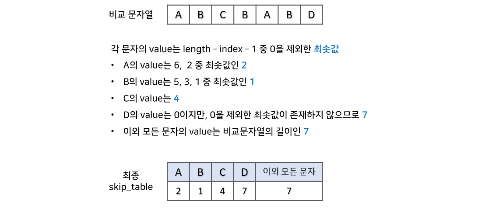

<h1>Boyer-Moore Algorithm</h1>

보이어-무어 알고리즘은 문자열 검색에 사용되며, 보통 상황에서 문자열은 앞부분보다는 뒷부분에서 불일치가 일어날 확률이 높다는 가정을 전제로 진행됩니다. => 따라서 오른쪽 끝부터 비교를 시작합니다.

**시간복잡도** : **O(N), O(MN)** => N : 텍스트의 길이, M : 패턴의 길이(brute force는 O(NM) 입니다.)

- O(N) : 일반적인 상황으로 KMP 알고리즘보다 빠르게 동작합니다.
- O(MN) : 텍스트와 패턴의 모든 문자가 동일할 때 최악의 경우가 발생합니다
  - 텍스트 : 'AAAAAAAAAAA', 패턴 : 'AAA'

---

내용


- 패턴의 오른쪽 끝에 있는 문자(e)와 본문(z)를 비교하여 일치 여부를 판단합니다.
- 불일치하고, 이 문자(z)가 패턴(apple)에 존재하지 않는다면, 패턴의 길이만큼 패턴을 이동시킵니다.


- 만일 패턴의 오른쪽 끝에 있는 문자(e)가 본문(p)와 비교해서 불일치하지만, 본문 문자(p)가 패턴(apple)에 존재한다면, 패턴의 오른쪽 끝에서부터 그 문자(p)까지의 칸 수를 세서 그만큼 이동시킵니다. => 2칸 이동

---

skip table 만들기



- 문자열에 불일치가 일어나면 마지막 문자를 기준으로 skip_table의 value만큼 뒤로 이동시킵니다.

---

예시


- 패턴의 e와 본문의 s는 불일치하며, s는 패턴에 없는 다른 문자이므로 패턴의 길이만큼 패턴을 이동시킵니다.


- 패턴의 e와 본문의 n은 불일치하며, n는 패턴에 있는 문자이므로, skip 테이블의 ‘n’을 보고 5칸 이동시킵니다.


- 패턴의 e와 본문의 e는 일치하므로, 이동하지않고 패턴의 오른쪽 그 다음 끝부터 본문과 비교합니다.


- 본문의 문자와 패턴을 차례로 다 비교해서 모두 일치하는 경우 검색이 완료됩니다.
- 본문이 뒤에 더 있을 경우, 검색 완료 후에도 패턴의 길이만큼 다시 점프해서 검색을 진행합니다.

---

구현

```python
def boyer_moore(string, pattern):
    #skip table 만들기
    skip=dict()
    for i in range(len(pattern)):
        if not pattern[i] in skip:
            skip[pattern[i]]=len(pattern)
        if i==len(pattern)-1:
            continue
        skip[pattern[i]]=len(pattern)-i-1
    ####

    i = 0
    findFlag = False
    while i <= len(string)-len(pattern):
        j = len(pattern) - 1
        while j >= 0:
            if pattern[j] != string[i+j]:
                if string[i+j] in skip:
                    move=skip[string[i+j]]
                else:
                    move=len(pattern)
                break
            j-=1
        if j == -1:
            findFlag=True
            print('성공!')
            i+=1
        else:
            i += move
    if not findFlag:
        print('찾기 실패')

boyer_moore("ABAABACABAACCABACABACABAACABACABAAC","ABACABAAC")
```