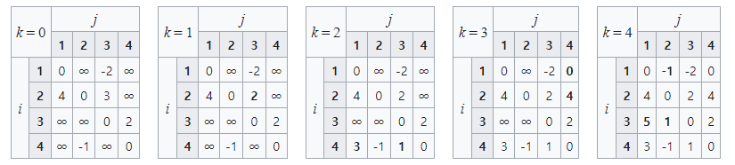

# 📌플로이드-워셜 알고리즘

- 변의 가중치가 음이거나 양인 가중 그래프에서 최단 경로들을 찾는 알고리즘
  - 음수 사이클은 없어야 함
- 모든 꼭지점 쌍 간의 최단 경로의 길이(또는 가중치의 합)을 구할 수 있음

- 2차원 테이블에 최단 거리 정보 저장
  - 최대값으로 초기화 해야 함
- 시간 복잡도: `O(V^3)` , V는 vertex의 개수
  - 3중 for문 활용
- 시작점 i, 목적지 j, 경유지 k 를 활용하여 for문 형성
  - 경유지 k 가 가장 바깥쪽 for문에 위치
  - 아래 사진에서 k=0인 경우는 조건에서 주어진 경로를 넣는 과정

사진 예시는 <https://ko.wikipedia.org/wiki/플로이드-워셜_알고리즘/> 참고





<br>

<br>

### Python Code🖋

- 3중 for문을 구현할 때, 경유지 `k` 가 가장 바깥쪽 for문에 있어야 함
  - 경유지를 바꿔가며 최단 경로를 계속 update 하기 위함

```python
# Vertex 개수 : n 기준

# k : 경유지
for k in range(n):
    # i : 출발지
    for i in range(n):
        # j : 목적지
        for j in range(n):
            # dp[i][j] = min(dp[i][j], dp[i][k]+dp[k][j])
            if dp[i][j] > dp[i][k] + dp[k][j] :
                dp[i][j] = dp[i][k] + dp[k][j]
```


<br>

<br>

#### Practice🔍

- 백준 #11404. 플로이드
  - https://www.acmicpc.net/problem/11404
- 2021 카카오 블라인드 채용 - 합승 택시 요금
  - 다른 다양한 방법으로 풀 수 있지만, 플로이드-워셜로도 풀 수 있음