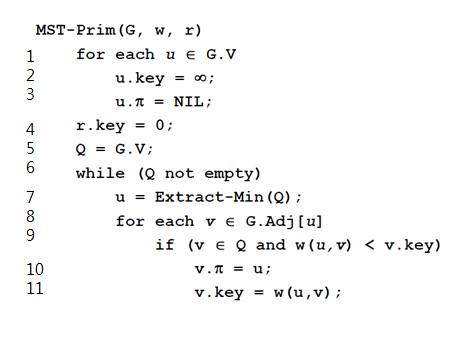
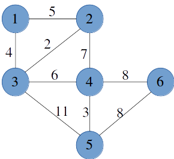
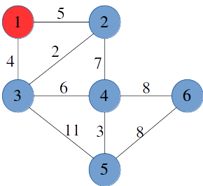
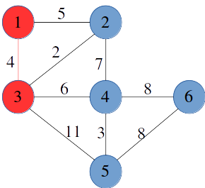
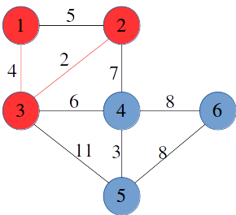
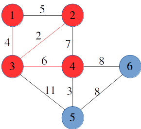
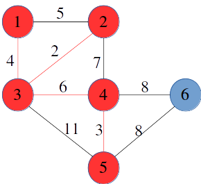
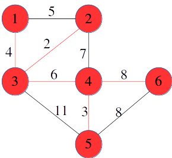

<h1>Prim</h1>

가중치가 있는 무향 연결 그래프가 주어질 때, 모든 꼭짓점을 포함하면서 각 변의 비용의 합이 최소가 되는 부분 그래프인 MST를 찾는 알고리즘입니다.

- **시간복잡도**
  - binary heap : O(E log V)
  - unsorted array : O(|V|^2)
- 정점 선택을 기반으로 하는 알고리즘
- 시작 정점을 기준으로 가장 작은 간선과 연결된 정점을 선택하며 신장 트리를 확장시키는 알고리즘
- 크루스칼 알고리즘과는 다르게 트리를 구성하면서 알고리즘이 진행되므로 사이클이 만들어지지 않는다.
- 간선의 개수가 많은 경우에는 __Prim__ 알고리즘을 사용

---

<h3>과정</h3>

- 임의의 정점을 선택하여 비어있는 Tree에 포함시킨다
- Tree에 있는 노드와 Tree에 없는 노드 사이의 간선 중 가중치가 최소인 간선을 찾는다
- 찾은 간선이 연결하는 두 노드 중, Tree에 없던 노드를 Tree에 포함시킨다(step1에서 찾은 간선도 같이 Tree에 포함)
- 모든 노드가 T에 포함될때까지 위 과정을 반복한다

---

<h3>pseudo code</h3>



- 1~3 : 그래프의 모든 정점에 대해 key 값을 inf로 할당하고, 부모를 NIL로 할당합니다.
- 4~5 : 시작 정점의 key 값을 0으로 하고, 그래프의 모든 점을 최소 우선순위 큐에 삽입합니다
- 6~7 : 최소 우선순위 큐가 비어있을 때까지 반복문을 수행하며, 매 반복문마다 key 값이 최소인 정점을 추출합니다.
- 8~11 : 추출한 정점의 모든 인접한 정점에 대해, 가중치와 정점의 key 값을 비교해서 key 값이 더 크면 key 값을 가중치 값으로 변경하고, 부모를 추출된 정점에 할당합니다.

---

<h3>과정</h3>



- 초기 상태 tree에는 아무것도 포함되어 있지 않고, 시작점을 1이라고 가정하고 풀이 시작



- 1을 tree에 포함시킨다.



- 빨간색과 파란색을 연결하는 간선 중 가중치가 최소인 1-3을 연결한 가중치 4의 간선을 선택하고, tree에 없는 노드3을 tree에 포함시킵니다.



- 2-3을 연결한 가중치 2의 간선을 선택하고, tree에 없는 노드2를 tree에 포함시킵니다.



- 3-4를 연결한 가중치 6의 간선을 선택하고, tree에 없는 노드 4를 tree에 포함시킵니다.



- 4-5를 연결할 가중치 3의 간선을 선택하고, tree에 없는 노드 5를 tree에 포함시킵니다.




- 4-6을 연결할 가중치 8의 간선을 선택하고, tree에 없는 노드 6을 tree에 포함시킵니다.
- 위와 같은 과정으로 간선의 가중치의 합이 23인 트리가 완성되었으며, 위 트리가 그래프의 MST입니다.

---

<h3>구현</h3>

- binary heap : O(E log V)

```python
import heapq
total_weight = 0 # 전체 가중치
# prim 알고리즘
def prim(graph, start_node):
    global total_weight
    visited[start_node] = 1 # 방문 갱신
    candidate = graph[start_node] # 인접 간선 추출
    heapq.heapify(candidate) # 우선순위 큐 생성
    mst = [] # mst

    while candidate:
        weight, u, v = heapq.heappop(candidate) # 가중치가 가장 적은 간선 추출
        if visited[v] == 0: # 방문하지 않았다면
            visited[v] = 1 # 방문 갱신
            mst.append((u,v)) # mst 삽입
            total_weight += weight # 전체 가중치 갱신

            for edge in graph[v]: # 다음 인접 간선 탐색
                if visited[edge[2]] == 0: # 방문한 노드가 아니라면, (순환 방지)
                    heapq.heappush(candidate, edge) # 우선순위 큐에 edge 삽입
```

- unsorted array : O(|V|^2)

```python
s = 0

def prim(r, V):
    global s
    MST = [0]*(V+1)     # MST 포함여부
    MST[r] = 1
    for _ in range(V):
        u = 0
        minV = 10000
        # MST에 포함된 정점i와 인접한 정점j 중 MST에 포함되지 않고 가중치가 최소인 정점 u찾기
        for i in range(V+1):    
            if MST[i]==1:
                for j in range(V+1):
                    if adjM[i][j]>0 and MST[j]==0 and minV>adjM[i][j]:
                        u = j
                        minV = adjM[i][j]
        s += minV
        MST[u] = 1
```

