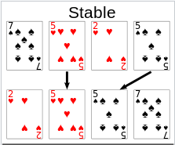
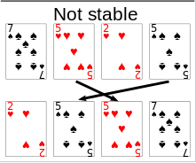
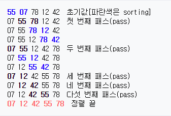
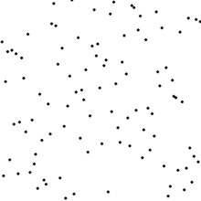

<h1>Sort</h1>

- 안정 정렬(Stable) : 중복된 원소를 원래 순서대로 정렬(<->Unstable)



- 제자리 정렬(In-place) : 입력 배열 이외에 다른 추가 메모리를 요구하지 않는 정렬(<->Not in-place)

---

<h3>bubble sort</h3>



- 서로 인접한 원소를 검사하여 정렬하는 알고리즘
- 시간복잡도 => Avg : O(n^2), Worst : O(n^2)
- Utable sort, In-place sort

```python
def bubbleSort(x):
	length = len(x)-1
	for i in range(length):
		for j in range(length-i):
			if x[j] > x[j+1]:
				x[j], x[j+1] = x[j+1], x[j]
	return x
```

---

<h3>selection sort</h3>



- 원소를 넣을 위치는 이미 정해져 있고, 어떤 원소를 넣을지 선택하는 알고리즘
- 시간복잡도 => Avg : O(n^2), Worst : O(n^2)
- Unstable sort, In-place sort

```python
def selectionSort(x):
	length = len(x)
	for i in range(length-1):
	    indexMin = i
		for j in range(i+1, length):
			if x[indexMin] > x[j]:
				indexMin = j
		x[i], x[indexMin] = x[indexMin], x[i]
	return x
```

---

<h3>insertion sort</h3>


- 자료 배열의 모든 요소를 앞에서부터 차례대로 이미 정렬된 배열 부분과 비교하여, 자신의 위치를 찾아 삽입하는 알고리즘
- 시간복잡도 => Avg : O(n^2), Worst : O(n^2)
- Stable sort, In-place sort

```python
def insertSort(x):
	for i in range(1, len(x)):
		j = i - 1
		key = x[i]
		while x[j] > key and j >= 0:
			x[j+1] = x[j]
			j = j - 1
		x[j+1] = key
	return x
```

---

<h3>merge sort</h3>


- 하나의 리스트를 두 개의 균등한 크기로 분할하고 분할된 부분 리스트를 정렬한 다음, 두 개의 정렬된 부분 리스트를 합하여 전체가 정렬된 리스트가 되게 하는 알고리즘
- 시간복잡도 => Avg : O(n log n), Worst : O(n log n)
- Stable sort, Not in-place sort

```python
def merge(left, right):
    i, j = 0, 0
    sorted_list=[]
    
    while i<len(left) and j<len(right):
        if left[i]<right[j]:
            sorted_list.append(left[i])
            i+=1
        else:
            sorted_list.append(right[j])
            j+=1
    
    while i<len(left):
        sorted_list.append(left[i])
        i+=1
    while j<len(right):
        sorted_list.append(right[j])
        j+=1
    
    return sorted_list

def mergeSort(numbers):
    if len(numbers)<=1:
        return numbers
    mid = len(numbers)//2
    left=numbers[:mid]
    right=numbers[mid:]
    
    sorted_left=mergeSort(left)
    sorted_right=mergeSort(right)
    return merge(sorted_left,sorted_right)
```

---

<h3>quick sort</h3>


- 하나의 리스트를 피벗(pivot)을 기준으로 두 개의 비균등한 크기로 분할하고 분할된 부분 리스트를 정렬한 다음, 두 개의 정렬된 부분 리스트를 합하여 전체가 정렬된 리스트가 되게 하는 알고리즘
- 시간복잡도 => Avg : O(n log n), Worst : O(n^2) 
  - Avg : 불필요한 데이터의 이동을 줄이고 먼 거리의 데이터를 교환할 뿐만 아니라, 한 번 결정된 피벗들이 추후 연산에서 제외되는 특성을 가져서 가장 빠른 알고리즘으로 불립니다.
  - Worst : 리스트가 계속 불균형하게 나눠지는 경우(특히, 이미 정렬된 리스트에 대하여 Quick sort를 실행하는 경우) 발생합니다.
- Unstable sort, In-place sort(정의에 따라서 Not in-place sort로 볼 수도 있으나 흔히 In-place로 봅니다)

```python
# 기본 개념 그대로
def quickSort(x):
    if len(x) <= 1:
        return x

    pivot = x[len(x) // 2]
    less = []
    more = []
    equal = []
    for a in x:
        if a < pivot:
            less.append(a)
        elif a > pivot:
            more.append(a)
        else:
            equal.append(a)

    return quickSort(less) + equal + quickSort(more)
```

```python
# 메모리 최적화
def partition(arr, start, end):
    pivot = arr[start]
    left = start + 1
    right = end
    done = False
    while not done:
        while left <= right and arr[left] <= pivot:
            left += 1
        while left <= right and pivot <= arr[right]:
            right -= 1
        if right < left:
            done = True
        else:
            arr[left], arr[right] = arr[right], arr[left]
    arr[start], arr[right] = arr[right], arr[start]
    return right

def quickSort(arr, start, end):
    if start < end:
        pivot = partition(arr, start, end)
        quickSort(arr, start, pivot - 1)
        quickSort(arr, pivot + 1, end)
    return arr
```

---

<h3>heap sort</h3>


- heap : 최댓값 및 최솟값을 찾아내는 연산을 빠르게 하기 위해 고안된 완전이진트리를 기본으로 한 자료구조
- 최대 힙 트리나 최소 힙 트리를 구성해 정렬을 하는 알고리즘
- 시간복잡도 => Avg : O(n log n), Worst : O(n log n) 
- Unstable sort, In-place sort

```python
def heapify(unsorted, index, heap_size):
    largest = index
    left_index = 2 * index + 1
    right_index = 2 * index + 2
    if left_index < heap_size and unsorted[left_index] > unsorted[largest]:
        largest = left_index
    if right_index < heap_size and unsorted[right_index] > unsorted[largest]:
        largest = right_index
    if largest != index:
        unsorted[largest], unsorted[index] = unsorted[index], unsorted[largest]
        heapify(unsorted, largest, heap_size)

def heapSort(numbers):
    n = len(numbers)
    for i in range(n // 2 - 1, -1, -1):
        heapify(numbers, i, n)
        
    for i in range(n - 1, 0, -1):
        numbers[0], numbers[i] = numbers[i], numbers[0]
        heapify(numbers, 0, i)
    return numbers
```

---

#추가 자료#

<h3>Python에서의 lilst.sort()와 sorted()</h3>

- Tim Sort : 데이터의 정렬된 정도에 따라 Insertion Sort와 Merge Sort 사이를 전환하는 적응형 알고리즘
  - 추가 메모리를 사용하지만 기존의 merge에 비해 적은 추가 메모리를 사용하여 다른 O(n log n) 정렬 알고리즘의 단점을 최대한 극복한 알고리즘
  - 적당히 작은 n에 대해서는 insertion이 merge보다 빠른 속도를 보여주므로, merge로 데이터를 나눈 후 각각에 대해 삽입정렬을 이용해서 시간을 줄이는 방식 이용
  - 참고 : https://ssungkang.tistory.com/entry/python-%ED%8C%8C%EC%9D%B4%EC%8D%AC%EC%9D%98-%EC%A0%95%EB%A0%AC-Tim-Sort