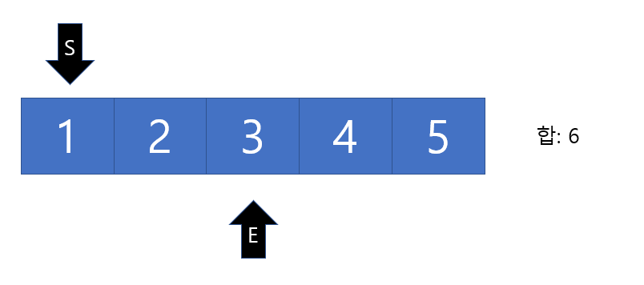
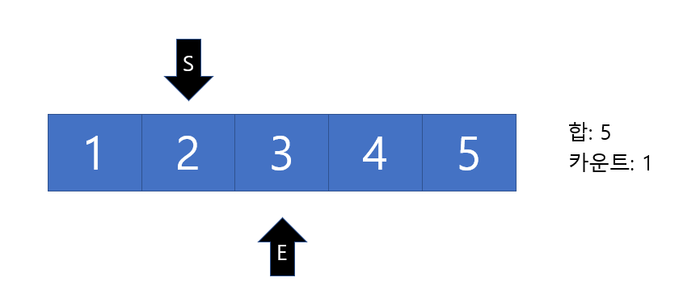
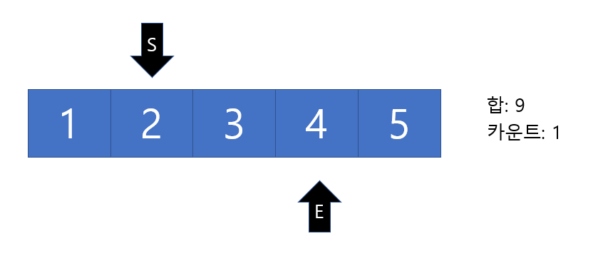
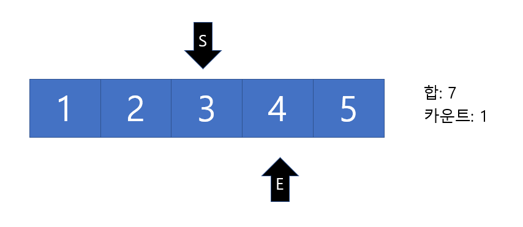
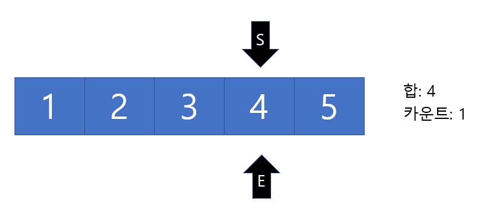
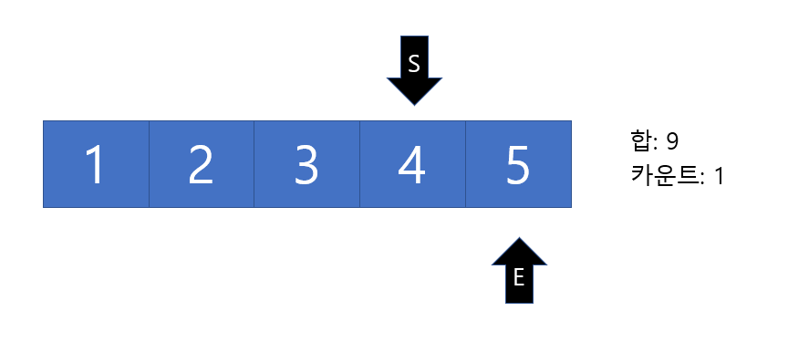
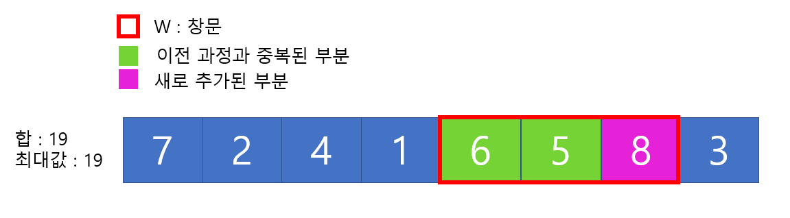
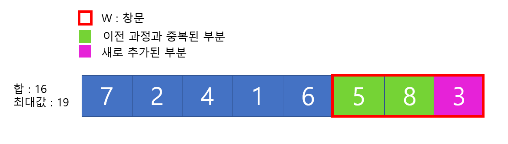

# Two Pointers & Sliding Window 

 ## 1. 투포인터 알고리즘이란?

- 리스트에 순차적으로 접근해야 할 때 두 개의 점의 위치를 기록하면서 처리 하는 알고리즘
- 배열의 특정 __연속된__ 데이터 구간을 처리해야할 때 사용하면 좋다

<br>

<br>

## 대표적인 활용 예 - 특정한 합을 가지는 부분연속 수열 찾기 

<br>

### <문제> 

- N 개의 자연수로 구성된 수열
- 합이 M인 부분 연속 수열의 개수를 구하시오.
- 연속 수열이란 [ 1, 2, 3, 4, 5] 수열 중 (1), (1, 2, 3), (3, 4) 와 같이 연속된 숫자를 말한다.

<br>

### <풀이 과정>

1. 시작점(start)과 끝점(end)이 첫 번째 원소의 인덱스(0)를 가리키도록 한다.
2. 현재 부분 합이 M 과 같다면, 카운트를 1증가한다.
3. 현재 부분합이 M보다 작다면 , end를 1 증가 시킨다.
4. 현재 부분합이 M보다 크다면, start를 1 증가 시킨다.
5. 모든 경우를 확인할 때까지 해당 과정을 반복한다.

<br>

#### M(합)이 5인 연속 수열의 개수 

- 
- Start와 End가 첫 번째 인덱스 0을 가리킨 상태, 이때의 합은 1이다.
- 이때 합이 M보다 작기때문에 End 를 증가시킨다.
- 
- 아직 M보다 합이 작기 때문에 과정을 반복한다.
- 
- 이때는 M보다 합이 커졌기 때문에 Start를 증가 시킨다.
- 
- 합이 5가 되었으기에 카운트를 1 증가 시키고 End를 증가 시킨다.
- 
- 과정 반복
- 
- 
- 
- 마지막 인덱스 까지 찾고 도달하면 알고리즘이 종료 된다.

<br>

<br>

### 투 포인터 알고리즘 코드

```python
# 데이터 개수 N과 부분 연속 수열 합 M을 입력 받기
N, M = 5, 5
data = [1, 2, 3, 4, 5]

cnt = 0  # 부분 연속 수열의 수
tmp = 0  # 부분 합
end = 0

# start를 차례대로 증가 시키며 반복
for start in range(N):
	# end를 가능한 만큼 이동시키기
	# 부분합이 M보다 작거나 수열의 마지막 인덱스이면 while문 종료
	while tmp < M and end < N:
		tmp += data[end]
		end += 1
	# 부분 합이 m일 때 카운트 증가
	if tmp == M:
		cnt += 1
	tmp -= data[start]

print(cnt)

```

<br>

<br>

## 투 포인터 알고리즘의 시간 복잡도

- 일반적으로 위의 예제를 반복문을 중첩하여 사용하면 시간 복잡도는 __O(N²)__
- 투 포인터를 사용한다면 start와 end가 길이 N을 돌면 되기때문에 시간복잡도는 __O(N)__ 이 된다.

<br>

<br>

+++

## 2. Sliding Window 알고리즘 이란?

- 배열이나 리스트의 요소의 __일정한 범위__의 값을 비교할 때 사용하면 유용한 알고리즘
- [1, 2, 4, 1, 2, 5, 2,  6,  6,  7,  2]와 같은 배열이 존재 할때 길이가 3인 연속된 서브 배열의 합이 가장 큰 경우의 합을 구할 때 용이하다.
- 즉 N개의 원소를 갖는 배열에서 W의 넓이를 가지는 창문을 계속 밀면서 이동하며 계산한다고 생각하면 된다.

<br>

<br>

## 대표적인 활용 예 - 구간 합

### <문제 설명>

- N 개의 숫자 배열,  W의 구간이 주어졌을 때 N개의 숫자배열에서 W 구간의 합이 최대인 경우를 모두 구하여라 
-  [7, 2, 4, 1, 6, 5, 8, 3] 의 8 개의 숫자 N이 주어지고 W 는 3이 주어졌다고 가정

<br>

### <풀이 과정>

- Window를 한 칸 옮기면 중복되는 부분이 발생하고 중복되는 부분을 제외한 곳에서 연산을 하는 방법

- 
- 위와 같이 창문을 설정하고 알고리즘을 진행한다.
- 
- 
- 
- 
- 위와 같은 방법으로 창문의 마지막 위치가 숫자 배열의 마지막 인덱스라면 해당 알고리즘을 종료하고 최대값을 반환한다. 

<br>

<br>

### Sliding Window 알고리즘 코드

```python
# 배열의 길이 N과 창문의 길이 W 입력받기
N, W = 8, 3
data = [7, 2, 4, 1, 6, 5, 8, 3]

# 각각의 값 초기 설정
tmp = 0
maxV = 0
start = 0
end = 0

# window 밀기 시작
while end < N:
	# 창문길이 맞추기
	if end-start < W:
		tmp += data[end]
		end += 1
		continue
	# 창문길이가 맞춰졌으면 최대값 비교
	tmp -= data[start]
	tmp += data[end]
	if tmp > maxV:
		maxV = tmp
	# 창문 이동
	start += 1
	end += 1

print(maxV)

```

<br>

<br>

## Sliding Window의 시간복잡도 

- 위의 예제에서 Sliding Window의 아이디어를 적용하면 __O(N)__ 의 시간 복잡도를 가질 수 있다. 


+++

## 3. Sliding Window 와 Two Pointer 알고리즘의 차이점

- 구하고자 하는 <strong>배열의 길이가 일정하지 않을 때는 투 포인터 알고리즘</strong>을 사용할 수 있고 <strong>일정하다면 슬라이딩 윈도우 알고리즘</strong>을 사용할 수 있다.
- 위의 예시에서는 투 포인터와 비교하기위해 sliding window 코드를 start, end를 놓고 비교했지만 고정적인 길이를 알고있기 때문에 변수를 1개만 사용하여 부분 배열의 길이를 정할 수 있다.


