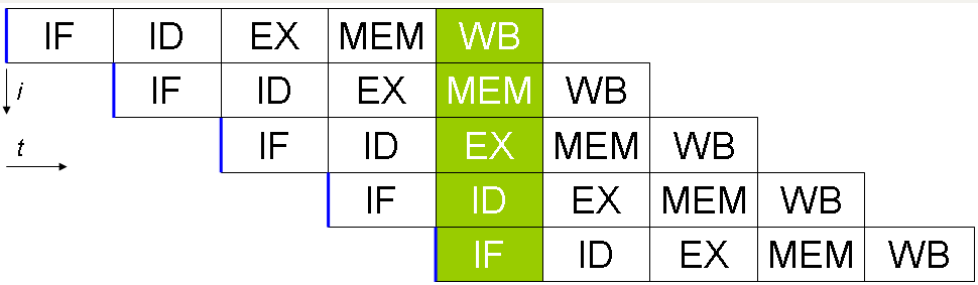
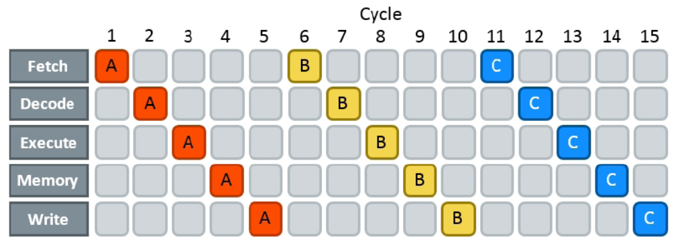
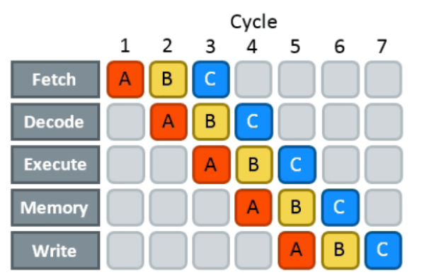

# [컴퓨터 구조] 파이프라이닝 1

## 1. 파이프라이닝(Pipelining)이란?

- 여러 명령어가 중첩되어 실행되는 구현 기술
- 
- 파이프라이닝을 세탁기와 비유해서 설명하면 다음과 같은 그림이 나온다
- 먼저, 파이프라인되지 않은 세탁방법은(그림에서 위 부분)
  1. 세탁기에 한 묶음의 더러운 옷을 넣는다.
  2. 세탁기가 끝나면 젖은 옷을 건조기에 넣는다.
  3. 건조가 끝나면 건조됫 옷을 탁자위에 놓고 갠다.
  4. 개는 일이 끝나면 같은 방 친구에게 옷을 보관장소에 넣어 달라고 부탁한다.
  5. 친구가 일을 끝내면 다음 옷을 한 묶음을 똑같은 과정으로 처리한다.
- 그림에서 아래 부분은 파이프라인 방식을 활용한 세탁 방법이다.
  1. 첫 번째 묶음의 세탁이 끝나서 건조기에 넣는다.
  2. 두 번째 더러운 옷 묶음을 세탁기에 넣는다.
  3. 첫 번째 묶음이 건조되면 탁자위에 놓고 갠다. 
  4. 두 번째 묶음을 건조기에 넣고 세 번째 묶음을 세탁기에 넣는다.
  5. 친구에게 갠 빨래를 정리를 부탁하고 두 번째 묶음을 개기 시작하며 세번째 묶음을 건조기에 넣고 네번째 묶음을 세탁기에 넣는다.
- 이처럼 파이프라인 방식으로 일을 처리하면 사용하지 않는 것보다 __시간이 훨씬 덜 걸리는 장점__이 있다.
- 여기서 파이프라이닝의 역설적인 점은 빨래양이 많든 양말을 하나 빨든 세탁기, 건조, 개고 넣는 과정의 시간이 파이프라이닝을 짧아지는 것이 아니라는 것이다. (파이프라이닝에서든 세탁, 건조, 개기, 정리의 각 과정을 __단계 stage__ 라고 표현한다.)
- 여러개의 빨래 묶음이 존재할 때 파이프라이닝이 더 빨리 끝나는 이유는 모든 작업이 병렬로 동작하여 같은 시간에 더 많은 묶음을 끝낼 수 있기 때문이다.

## 2. 파이프라이닝 처리 시간

- 위 그림에서 처럼 파이프라이닝은 세탁 시스템의 __처리량__을 증가시킨다.
- 모든 단계의 처리시간이 거의 같고, 할 일이 충분히 많다면 파이프라이닝에 의한 속도 향상은 파이프 라인의 단계수와 같다. 위 그림같은 경우는 세탁, 건조, 개기, 넣기로 4이다. 
- 위의 그림에서는 파이프라이닝을 통해 2.3배가 빠른데 이 경우는 처리 묶음이 4개 밖에 없기 떄문이다. 이는 할 일의 수가 파이프라인 단계수에 비해 많지 않을 경우에는 시작 시간과 마무리 시간이 성능에 영향을 미치기 때문이다. 

## 3. 명령어 파이프라이닝

- RISC-V 명령어는 전통적으로 5단계가 걸린다.
  1. 명령어 메모리에서 명령어 인출 (IF-Instruction Fetch)
  2. 명령어 해독과 레지스터 읽기(동시에 수행) (ID - Instuction Decode)
  3. 연산 수행 or 주소 계산 (EX - Excution)
  4. (필요하면) 데이터 메모리의 피연산자 접근(MEM - memeory)
  5. (필요하면) 결과갑을 레지스터에 작성 (WB - Write back)
- 

## 4. 정리 

- 파이프 라이닝은 여러 명령어를 중첩하여 실행
- 한 명령어를 처리하고 그 이후에나 다음 명령명어를 처리시키는 방식 이외에 한 사이클 안에서 쉬는 컴포넌트 없이 작업하여 더 효율적(더 많은 양의)인 처리를 가능하게 함
- 위의 그림은 단일 사이클에서는 15사이클에 끝나던 일을 파이프라이닝을 통해 7사이클만에 처리하는것을 나타냄

