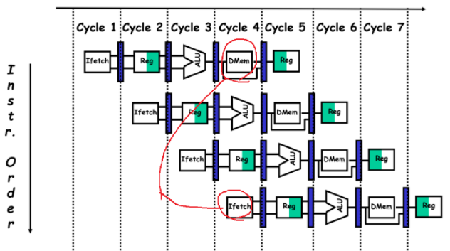
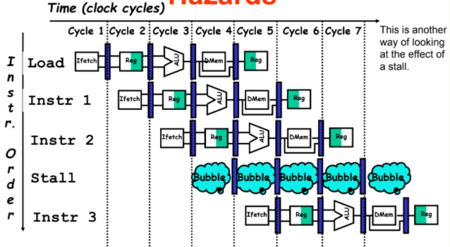
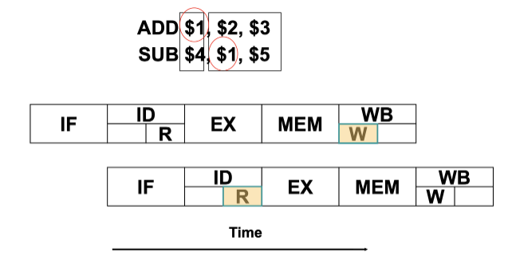
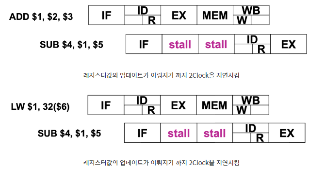
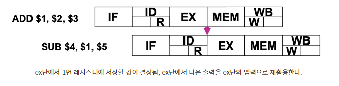
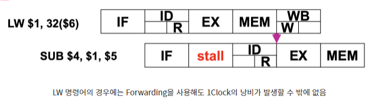
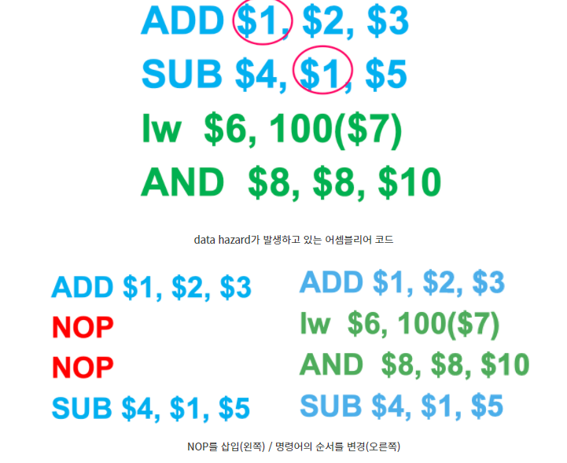

# [컴퓨터구조] 파이프라이닝 2

## 1. 파이프라인 해저드(Pipelining Hazard)

  다음 명령어가 다음 클럭 사이클에 실핼될 수 없는 상황이 발생한다.  파이프라이닝의 한단뎨는 한 클럭이 소용된다. 해저드는 세 가지 종류로 구분 할 수 있다. 

 

### 1-1) Structural hazard(구조적 해저드)

  주어진 클럭 사이클에 실행되도록 되어있는 명령어 조합을 하드웨어가 지원하지 못해서 계획된 명령어가 적절한 클럭 사이클에 실행될 수 없는 상황을 말한다. 

- 
- Structural Hazard는 ALU나 Memory에 자주 발생한다. 
- 위의 그림처럼 동싱에 접근하거나 아리면 Floating 연산과 같이 ALU가 한 사이클 이상이 소요될때 Pipeline이 늘어지면서 문제가 발생한다. 

- 
- Stall cycle 사용하기 Bubble이라고 한다.
- 위의 그림처럼 Bubble을 사용하여 1 클럭 정지시키는 것이다. 
- 아니면 Hardware resource를 개선하는 방안이 있지만 비용이 발생한다는 단점이 있다.

 

 

### 1-2) Data Hazard

- 명령어를 실행하는 데 필요한 데이터가 아직 준비(생성)되지않아 계획된 다음 명령어가 적절한 클럭 사이클에 실행되지 못하는 경우(인접한 명령서 사이에 data dependency가 존재하는 경우!)
- 
- 위의 그림에서 보듯 ADD 연산의 결과를 1번 레지스터에 저장하는데 뒤에 바로 1번 레지스터를 rs필드로 사용하는 SUB 명령어가 뒤 따라오고 있다. 
- 이 경우 ADD 연산의 결과가 1번 레지스터에 저장되지 않을 때 발생하기에 정상적인 처리가 발생하지않고 data hazard가 발생한다. 

<해결방안>

1. __Stall__

   - 
   - 파이프라인 상에 진입한 명령어가 더 이상 진행하지 못하도록 pipline을 freeze 시키는 것으로 이해하면 된다. 
   - 하지만 data harzard를 통한 문제 해결은 CPI가 크게 증가하면서 성능이 떨어지게 된다는 문제가 발생한다. 

   

   2.__Forwarding__

   - 하드웨어의 수정을 통해 이전 명령어의 실행결과로 나온 값들을 다음 명령어의 필요한 곳에 바로 사용할 수 있도록 하는것
   - 여기서 포인트는 레지스터가 업데이틑 되는 시점은 WB 지만 write를 하려는 레지스터 내용은 EX 단계에서 결정된다는 것이다. 바뀔내용을 미리 알 수 있으니 이 값을 바로 사용하는 아이디어이다.
   - 
   - 하지만 LW 명령어는 다음과 같은 문제가 발생한다.
   - 
   - LW의 경우 데이터가 EX단계에서 얻어지는 것이 아니라 MEM 단계에서 얻어지기 떄문에 MEM 단계까지 실행의 흐름이 길어진다. 때문에 한 클럭을 낭비 할 수 밖에 없다. 
   - 그러나 Stall에 비해서 시간적인 문제를 상대적으로 우수하게 개선할 수 있다.

   3.__Compiler Scheduling__

   - 컴파일러나 어셈블러와 같은 소프트웨어를 처음부터 잘 만들어 data hazard자체가 발생하지 않도록 구성하는 것
   - 장점으로 하드웨어적 수정에 대한 비용이 발생하지 않는다. 따라서 코드 작성자가 data hazard를 걱정하지 않고 프로그램을 작성할 수 있다.
   - 
   -  위의 예시처럼 녹색 부분의 명령어가 파란색 부분의 명령어와 data dependecy를 전혀 가지지 않는다. 따라서 순서를 아래쪽과 부분과 같이 변경해도 프로그램 동작에 지장을 발생하지 않는다. 
   - 이때 data dependency 를 가지는 2개의 명령어가 최소 2단계 이상 떨어져 있도록 해야한다. 

다음 시리즈에 파이프라이닝 3  제어해저드 및 MIPS 지연분기등을 자세하게 다루겠습니다.

