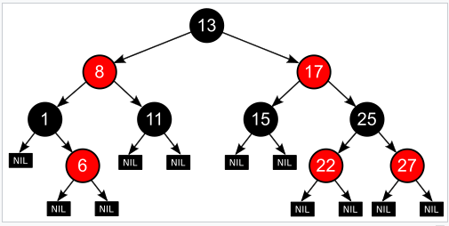
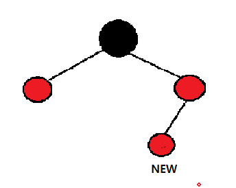
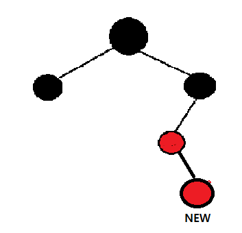

# Red Black Tree

### Red-Black Tree는 무엇인가?

기본적으로 이진트리는 특정 값을 찾는데 O(logN)의 시간이 소모되지만 트리에 값을 입력할 때, 입력 순서에 따라서 시간이 O(N)이 소모되게 입력이 될 수도 있다. (값이 오름차순 또는 내림차순으로 입력될 경우)

레드-블랙 트리는 후술할 규칙으로 삽입 또는 삭제 시 균형이 잡히게 되므로 삽입,삭제, 검색 모두 일정한 실행시간을 보장하게 되어있다.

다소 복잡한 규칙을 가지고 있지만, 실 사용에서 매우 효율적이며, 최악의 경우에도 우수한 실행시간을 보여준다.

### 특성

1. 각 트리의 노드는 Red 혹은 Black이다.
2. 트리의 루트(Root)노드는 블랙이다.
3. 모든 리프노드(NIL)는 블랙이다.
4. 레드 노드의 두 자식노드는 언제나 블랙이다.
5. 특정 노드부터 그 하위에 있는 모든 리프노드에 도달하는 경로에는 모두 같은 개수의 블랙 노드가 존재한다.

여기서 중요한 특징중 하나는 4번 레드노드의 두 자식노드는 언제나 블랙이다. 라는 점이다.

이 특징 때문에 모든 레드노드는 연달아서 나타날 수 없으며, 레드노드의 부모는 무조건 블랙노드여야만 한다.

이 4번 특성과 5번 특성으로 인해 가장 거리가 먼 노드의 경우 블랙-레드-블랙-레드.. 식으로 되어있는 경우가 될 것이고 가장 짧은 노드의 경우 블랙-블랙-블랙이 되어 탐색 시, 가장 먼 노드와 가장 짧은 노드의 거리는 2배 이하가 된다. 즉 개략적(Roughly)하게 균형이 잡혀있다고 볼 수 있다.

이러한 특성 덕분에 최악의 경우더라도 보통의 이진탐색 트리에 비해 효율적이라고 할 수 있다.

### 트리의 삽입 과정

모든 삽입은 RED노드로 삽입이 된다.

또한 삽입이 될 때마다, RED노드가 연속으로 오게 되는 경우, 규칙을 위반했기 때문에 Recoloring, Restructuring의 방법을 사용하여 해결한다.

##### Recoloring

* 삽입된 노드의 부모의 형제노드가 RED일 경우

* 
  * 이런 경우 부모노드와 그 형제노드를 모두  Black으로 색을 바꿔준다.
  * 또한 부모노드의 부모노드는 RED로 색을 바꿔주는데, 만약 부모의 부모가 Root node일 경우엔 검은색이어야 한다는 규칙이 있기 때문에, 이 경우엔 색을 변경하지 않는다.
  * 부모의 부모노드가 Root Node가 아닐 경우, 부모의 부모의 부모노드의 색에 따라 double red상황이 다시 발생 할 수 있다.
  * 이렇게 새로운 double red상황 발생 시, 규칙에 따라서 Recoloring 또는 Restructuring을 반복한다.

##### Restructuring

* 삽입된 노드의 부모의 형제 노드가 Black일 경우
* 
* 이런 식으로 부모의 형제노드에 값이 존재하지 않는 상황(NIL)인 경우도 Black이므로 이 경우에 해당한다.
  * 삽입된 노드, 부모, 부모의 부모 노드를 오름차순으로 정렬한다.
  * 중앙 값을 부모 노드로 만들며, 나머지 노드를 자식노드로 변환한다.
  * 부모를 Black 나머지 자식 노드를 Red로 색을 변경해준다.

### 트리의 삭제 과정

* 빨간색 노드를 삭제할 경우, 트리의 규칙에 영향이 없으므로 그냥 삭제를 실행해주면 된다.
* 검정색 노드 삭제 시, 트리의 속성이 깨지지 않도록 Double Red가 발생 시, 삽입 과정에서 했던 것과 유사한 방식으로 해결할 수 있다.

### Red-Black Tree의 시간 복잡도

* 탐색 시 : 평균 O(log n) 최악 O(log n)
* 삽입 : 평균 O(log n) 최악 O(log n)
* 삭제 평균 O(log n) 최악 O(log n)