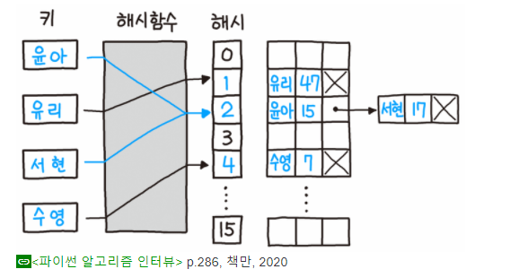
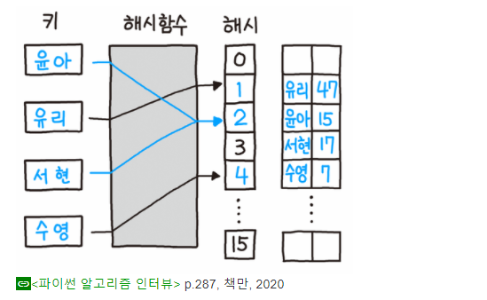
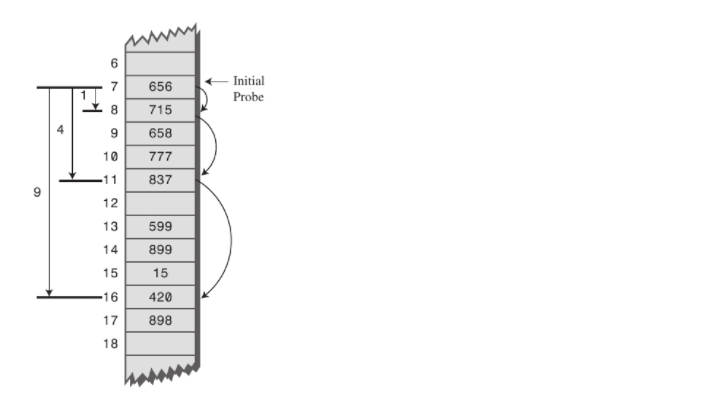

# 해시(Hash)

#### 해시란?

데이터를 효율적으로 관리하기 위해, 임의의 길이 데이터를 고정된 길이의 데이터로 매핑하는 것

해시함수를 사용하여 데이터를 받으면 고정된 길이의 데이터로 변경한다.

'AAAAA'->1 , 'AAAB'->2 같은 방식으로 임의의 데이터가 들어오면 데이터를 해시함수를 통해 변경해서 저장한다.

그러다보니 해싱함수를 통해서 서로 다른 데이터임에도 불구하고 같은 해시값이 나오는 경우가 있고 이것을 collision 현상 이라고 한다.

#### 해시 테이블을 사용하는 이유

* 적은 자원으로 많은 데이터를 효율적으로 관리하기 위해서
* 많은 가짓수의 데이터들을 해시값으로 매핑하여 작은 메모리로도 프로세스 관리가 가능해진다.
* 해시값의 리턴, index를 안다면 빠른 데이터 검색이 가능
* 해시 테이블의 시간복잡도 = O(1)

#### 사용 처

* 다양 한 자료구조 ex) 해시 테이블(해시 맵), 해시 셋(set), 블룸필터, 딕셔너리 등
* 캐시
* 중복 레코드 검색
* 유사 레코드 검색
* 유사 부분 문자열 검색
* 기하학적 해시
* 변조 탐지/에러 검출

#### Collision 해결방법

1. 체이닝 : 연결리스트를 활용해서 같은 해시값이 나오면 노드를 추가한다.  계속 연결이 가능하지만 메모리 문제가 발생할 수 있다.

2. Open Addressing : 해시 함수로 얻은 주소가 아닌 다른 주소에 데이터를 저장(주로 다음 칸에 저장한다)

3. 선형 탐사 : 정해진 고정폭으로 옮겨서 해시값의 중복을 피하는 방식

   

   출처 : https://ratsgo.github.io/data%20structure&algorithm/2017/10/25/hash/

4. 제곱 탐사 : 정해진 고정폭을 제곱수로 옮겨 중복을 피하는 방식

   

   출처 : https://ratsgo.github.io/data%20structure&algorithm/2017/10/25/hash/

   

5. 이중 해싱: 충돌이 일어났을 경우 이동폭을 구하기 위해 새로운 해시함수를 사용하여 최초해시 값이 같더라도 이동폭이 달라지고, 이동폭이 같더라도 최초값이 다르기 때문에 충돌을 완화할 수 있다.

#### 해시함수들

##### division method

간단하고 빠른 연산이 가능하다. 숫자로된 키 값을 받으면 해시테이블 크기로 나눈 나머지를 해시값으로 사용한다.

해시 테이블 크기는 소스를 사용하며 2의 제곱수와 차이가 큰 것을 사용할수록 좋다. 

##### multiplication method

숫자로 된 키값에 0에서 1사이의 수 A를 곱해준 후 정수부분을 뺸 나머지에 임의 값 m을 곱해주는 방식으로 결정한다. m은 보통 2의 제곱수로 정해지며 나눗셈법에 비해 느리다.

##### 

 

