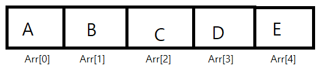
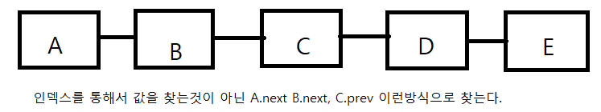

# Array List  vs  Linked List

* Array List 는 index로 빠르게 값을 찾는 것이 가능해서 데이터를 찾는것 자체는 빠르다(O(1))

* 하지만 어레이 중간에 데이터를 추가 또는 삭제하는 과정에서 시간이 오래걸린다 (O(N))

  

* Linked List는 Array List와는 다르게 데이터를 찾는 것은 느리지만(O(N))

* 데이터를 추가 또는 삭제하는 것은 쉽다. (O(1))

  

### Array List

* 기본적으로 Array는 선언시 크기와 데이터 타입을 지정함

  ```C
  int intArray[10];
  char chrArray[5];
  String strArray[10];
  ```

  

* 공간에 사이즈를 미리 정해놓고 사용하기 때문에 최대사이즈가 얼마나 될지 모른다면 부적합한 데이터 구조이다.
* 또한 사이즈를 정해놓고 사용하기 때문에 데이터를 중간에 삽입 삭제할 때 또한 매우 비효율 적이다(사이즈를 늘리거나 감소시켜야 하기 때문)
* 이런 문제를 해결하기 위해서 List개념을 활용해서 만든게 Array List (파이썬의 List가 이개념)
* 크기를 정해주지 않아도 된다는 장점이 있다. 
* 이 장점 덕에 최대사이즈를 몰라도 사용이 가능하며 데이터를 중간에 삽입 삭제하는 것 또한 가능하다.
* 다만 여전히 데이터를 중간에 삽입 또는 삭제 시 그 뒷부분 데이터들을 전부 옮겨야 하기 때문에 시간이 오래걸리며 메모리도 낭비된다.(O(N)의 시간이 소모)


### Linked List

* 각각의 노드를 포인터로 연결하는 방식으로 만든 List이다.

* 데이터를 중간에 삽입 또는 삭제 할 때, 서로를 연결하는 포인터가 가리키는 주소값만 수정하면 되기 때문에 시간이 적게 걸린다는 장점이 있다.

  ```C
  // A와 B노드 사이에 추가
  node new;
  new.next = A.next;
  A.next = new;
  // A-B-C라고 했을 때 B삭제
  A.next = B.next;
  //간단하게 적은것이고 조건이나 상황에 따라 다를 수 있음(다중연결리스트 라거나 다음 노드가 null이거나 할 경우)
  ```

* Linked List는 인덱스로 값 접근을 못하기 때문에 n번째 값을 찾아라 하는 경우에 비효율 적이다.


