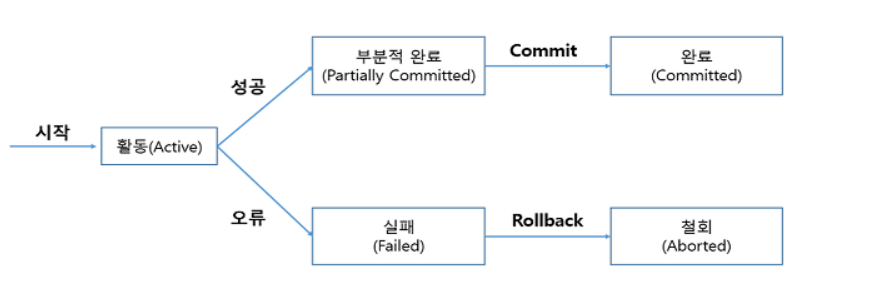

# [Data Base] Transaction

## 1. Transaction(트랜잭션)이란?

- <strong>하나의 작업을 수행하기 위해 필요한 데이터 베이스의 연산들을 모아놓은 것</strong>
- 데이터 베이스 연산은 SQL 문으로 표현하는데 트랜잭션 작업 수행에 필요한 SQL 문들의 모임으로 이해 가능
- 데이터베이스에서 논리적인 작접의 단위
- 장애가 발생했을 때 데이터를 복구하는 작업의 단위
- 즉, 데이터 베이스는 정확한 데이터를 유지하고 오류가 발생하면 빠르게 복구하여 DB가 항상 정확하고 일관된 상태를 유지할 수 있도록 다양한 기능을 제공하는데 이 기능에서 가장 중요한 역할을 하는 것이 Transaction이다.  
- 트랜잭션 관리를 통해 데이터 베이스의 회복과 병행 제어를 수행가능

 

 

## 2. 트랜잭션의 특징( A, C, I, D)

> 트랜잭션이 성공적으로 처리가 되고 그에따라 데이터베이스의 무결성과 일관성을 보장하려면 4가지 특성을 만족해야한다. 

### 2-1) **A**tomicity (원자성)

- 트랜잭션을 구성하는 연산들이 모두 정상적으로 실행되거나 하나도 실행되지 않아야 한다는 All-or-Nothing 방식을 의미한다. 
- 트랙잭션을 수행하는 도중 장애로 인해 작업을 완료하지 못했다면, <strong>실행한 연산들 모두 취소하고 데이터베이스를 트랜잭션 작업 전의 상태로 되돌려</strong> 원자성을 보장한다. 
- 원자성 보장을 위해서는 데이터베이스를 원래 상토로 복구하는 회복 기능이 요구된다.

 

### 2-2) **C**onsistency (일관성)

- 트랜잭션이 성공적으로 수행된 이후에도 데이터베이스가 일관성있는 상태를 유지해야하는 것을 의미한다. 
- 예를 들어 계좌 이체 진행시에 시행 전의 돈의 합과 진행 후의 돈의 합이 같아야하는 경우도 일관성이 유지되는 경우라고 볼 수 있다. 

 

### 2-3) **I**solation (격리성)

- 현재 수행 중인 트랜잭션이 완료 될 때까지 트랜잭션이 생성한 중간 연산 결과에 다른 트랜잭션들이 접근해서는 안되며 접근할 수 없는 것을 의미한다. 
- 시스템에서는 여러 트랙잭션이 동시에 수행되지만 각 트랜잭션이 독립적으로 수행될 수 있도록 중간 연산결과에 서로 접근하지 못하게 한다. 
- 이를 통해 트랜잭션이 동시에 수행되는 것 처럼 보이지만 순차적으로 처리되는 것 마냥 독립적이고 일관성 있는 결과를 얻을 수 있다. 

 

 ### 2-4) **D**urability (지속성)

- 트랜잭션이 성공적으로 완료 된 후 데이터베이스에 반영된 결과는 어떠한 경우에도 손실되지 않고 영구적으로 지속되어야 함을 의미한다.
- 시스템에 장애게 발생하더라도 트랜잭션의 작업 결과는 없어지지 않고 데이터베이스에 그대로 남아 있어야 한다. 
- 지속성을 보장하기 위해서는 데이터베이스를 원래 상태로 복구하는 회복기능이 필요하다. 

 

 

## 3. 커밋(Commit)과 롤백(Rollback)

> 위  설명처럼 여래 개의 연산 , 다시 말해 부분 작업들 여러개가 모여있는 트랜잭션을 처리하기 위해 데이터 베이스는 두가지 명령어를 활용한다. 

### 3-1) 커밋

- 모든 부분 작업이 정상적으로 완료되면 이 변경 사항을 <strong>한꺼번에</strong> 데이터베이스에 반영한다. 
- 완전저장 이라고 한다. 
- 커밋을 진행한다는 것은 하나의 트랜잭션 과정을 종료하는 것이다. 

### 3-2) 롤백

- 부분 작업이 실패했을 때 틀랜잭션을 실행하기 전 상태로 되돌린다. 
- 하나의 트랜잭션의 처리가 비정상적으로 종료되어 데이터베이스의 일관성을 해칠 때 <strong>트랜잭션의 일부가 정상적으로 처리가 되었더라도 전체적인 트랜잭션의 원자성을 구현하기 위해 해당 트랜잭션이 행한 모든 연산을 취소</strong>하는 연산이다. 
- 취소하게 되면 마지막 COMMIT을 완료한 시점으로 돌아간다. 

> 이때 모든 연산을 취소하는 것이 싫거나 다른 이유가 있어서 정해진 부분까지만 되돌리고 싶다면 <strong>Savepoint</strong>를 사용 할 수 있다.

  

 

## 4. 트랜잭션 상태 

1. 활동 : 트랜잭션이 실행 중에 있는 상태, 연산들이 정상적으로 실행 중인 상태를 만한다. 
2. 실패 : 트랜잭션이 실행에 올휴가 발생하여 중단된 상태
3. 철회 : 트랜잭션이 비정상적으로 종료되어 Rollback 연산을 수행한 상태
4. 부분적 완료 : 커핏 연산이 실행되기 직전의 상태로 아직 작성한 것들을 저장하지 않은 상태
5. 완료 : 트랜잭션이 성공적으로 종료되어 Commit 연산을 실행한 후의 상태

 

 

## 5. 트랜잭션(Transaction)을 사용할 때 주의점

- 트랜잭션은 데이터의 완전성을 보장하기 위해 많은 자원을 사용하게 된다. 
- 자원을 사용하며 Lock을 걸게 되면 다른 사용자들은  Lock이 해제 될 때까지 기다려야한다. 
- 이는 <strong>Lock이 걸리는 자원이 많아 지면 많아질 수록 성능은 반비례</strong>한다는 것을 의미한다. 
- 따라서 <strong>Transaction의 범위를 최소화 하여 적용</strong>하는 것이 보다 좋은 성능을 가질 수 있다. 

