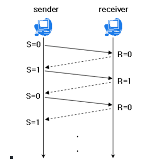

# TCP(흐름제어/혼잡제어)

### TCP 통신이란?

* 네트워크 통신에서 신뢰적인 연결방식을 의미
* unreliable network에서 reliable network를 보장할 수 있도록 하는 프로토콜
* network congestion avoidance algorithm을 사용

### reliable network를 보장함으로서 생기는 4가지 문제점

* 손실 : packet이 손실될 수 있음
* 순서 바뀜 : packet의 순서가 바뀜
* Congestion : 네트워크의 혼잡함
* Overload : receiver가 overload 되는 문제

### 흐름제어

* 송신측과 수신측의 데이터 처리속도 차이를 해결하기 위한 기법
* receiver가 packet을 지나치게 많이 받지 않도록 조절하는 것
* 기본 개념은 receiver가 sender에게 자신의 상태를 feedback함

### 혼잡제어

* 송신측의 데이터 전달과 네트워크의 데이터 처리 속도 차이를 해결하기 위한 기법

### 전송 과정

* Application layer : sender application layer가 socket에 data를 씀
* Transport layer : data를 segment에 감싸고 network layer에 넘겨준다
* receiving node로 전송이 되면 sender의 send buffer에 데이터를 저장하고, receiver는 receive buffer에 데이터 저장
* application에서 준비가 되면 이 buffer에 있는것을 읽기 시작
* 흐름제어의 핵심은 receiver buffer가 넘치지 않게 하는 것

### 흐름제어

* 수신측이 송신측보다 데이터 처리속도가 빠르면 문제 X

* 송신측이 더 빠른 경우엔 문제가 생김

* 수신측에서 데이터 저장용량을 초과할 경우 이후 보내진 데이터는 손실되기 때문에 불필요한 응답과 데이터 전송이 일어나게됨

* 해결 방법

  * Stop and Wait: 매번 전송한 packet에 대한 응답을 받은 이후 다음 패킷을 전송

    

    출처 : [tech-interview-for-developer/TCP (흐름제어혼잡제어).md at master · gyoogle/tech-interview-for-developer · GitHub](https://github.com/gyoogle/tech-interview-for-developer/blob/master/Computer Science/Network/TCP (흐름제어혼잡제어).md)

  * Sliding Window: 수신측에서 설정한 크기만큼 송신측에서 확인응ㄷ답 없이 세그먼트를 전송

    * 전송은 되었지만 Acked를 받지 못한 byte의 숫자를 파악하기 위해 사용하는 프로토콜

    * 동작 방법
      * 윈도우에 포함되는 모든 패킷을 전송, 전달이 확인되는대로 윈도우를 옮기면서 다음 패킷들을 전송하는 방식
      * TCP/IP의 모든 호스트들은 송신과 수신을위한 2개의 Window를 가지고 있으며 실제 데이터를 보내기 전, 3way handshaking을 통해 수신자의 수신용 윈도우 크기에 맞춰 자신의 송신용 윈도우 사이즈를 맞춘다.

### 혼잡 제어

* 한 라우터에 데이터가 몰리게 될 경우, 데이터를 모두 처리할 수 없게되는데, 여기서 또 재전송을 하게되면 오버플로우나 데이터 손실이 발생하는데 이것을 피하기 위해 데이터 전송속도를 줄이는 방식
* 네트워크 내 패킷의 수가 과도하게 증가하는 현상을 방지하거나 제거하는 기능
* 흐름제어는 송신,수신측의 전송속도를 다룬다면 혼잡제어는 호스트와 라우터를 포함한 넓은 관점에서 문제를 바라본다.
* 

