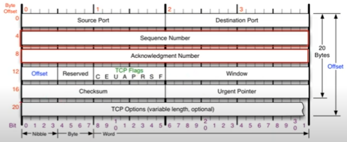
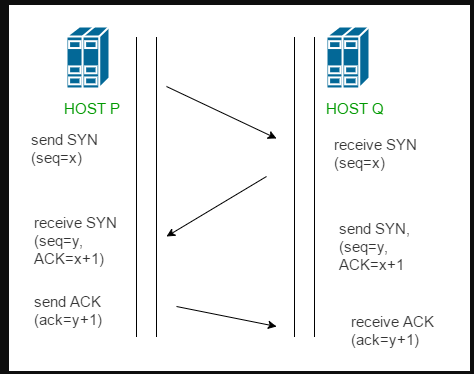

# UDP

* 사용자 데이터 그램 프토콜
* 비연결 지향
* 전송방식이 단순하여 신뢰성이 낮다.
* 오류의 검사와 수정이 필요 없는 프로그램에서 수행한다고 가정

### 구조 

송신자 포트번호(2byte)-수신자포트번호(2byte)-길이(헤더부터 페이로드까지 포함한 길이 Byte단위)-checksum(프로토콜이 잘못된게 있는지 체크)

### UDP사용 프로그램

* DNS 서버(도메인 주소의 IP주소를 알려줌)
* tftp서버
* RIP 프로토콜

# TCP(흐름제어/혼잡제어)

### TCP 통신이란?

* 네트워크 통신에서 신뢰적인 연결방식을 의미
* unreliable network에서 reliable network를 보장할 수 있도록 하는 프로토콜
* network congestion avoidance algorithm을 사용

### 구조 

출처 : https://www.youtube.com/watch?v=cOK_f9_k_O0&list=PL0d8NnikouEWcF1jJueLdjRIC4HsUlULi&index=21

* Offset - 헤더의 길이를 표현하는 부분

* Reserved - 예약된 필드(사용안함)

* TCP flag - C E U A P R S F 로 구성되어있음, 연결 상태를 보내주는 것(연결을 하려는건지 데이터를 보내려는건지 연결을 끊으려는지 등)
  * U - Urgent Flag, 긴급비트라고 한다. 우선순위가 높은 데이터가 포함되어 있는 경우 1로 세팅
  * A - Ack Flag, 승인비트라고 한다. 승인을 해줄 때 사용하는 플래그(연결이나 데이터 전송)
  * P - Push, TCP버퍼의 공간이 충분히 쌓이지 않아도 데이터를 계속 밀어넣겠다 라고 할 때 1로세팅
  * R - Reset, 초기화 비트, 문제가 발생해서 리셋할 경우 1로 세팅
  * S - Sync Bit, 동기화 비트, 상대방과 연결을 시작할 때 사용하는 플래그 동기화를 시작한다는 의미를 가짐
  * F - Fin, 종료비트, 데이터를 모두 주고받은 이후, 연결을 끊을 때 사용하는 플래그

* Window - 데이터를 얼마나 더 보낼지 정보가 담겨있는 곳(자신의 사용공간이 얼마나 남아잇는지)

* Urgent Pointer - U flag와 세트 긴급데이터가 어느위치에 있는지 표기하는 데이터

* TCP Option - IP 의 옵션과 같이 4Byte씩 붙으며 최대 10개까지 붙을 수 있다.(안붙을 수도 있다.) TCP 최대 용량: 60Byte

### reliable network를 보장함으로서 생기는 4가지 문제점

* 손실 : packet이 손실될 수 있음
* 순서 바뀜 : packet의 순서가 바뀜
* Congestion : 네트워크의 혼잡함
* Overload : receiver가 overload 되는 문제

### 흐름제어

* 송신측과 수신측의 데이터 처리속도 차이를 해결하기 위한 기법
* receiver가 packet을 지나치게 많이 받지 않도록 조절하는 것
* 기본 개념은 receiver가 sender에게 자신의 상태를 feedback함

### 혼잡제어

* 송신측의 데이터 전달과 네트워크의 데이터 처리 속도 차이를 해결하기 위한 기법

### 통신과정

* 연결 수립 과정

  통신을 할 때 프로세스와 프로세스 연결을 위해 가장 먼저 수행되는 과정

  1. 클라이언트가 서버에게 요청 패킷 전송
  2. 서버가 클라이언트의 요청을 받아들이는 패킷 전송
  3. 이를 최종적으로 수락

  3-Way Handshaking이라고 함

  

  출처 : https://github.com/gyoogle/tech-interview-for-developer/blob/master/Computer%20Science/Network/TCP%203%20way%20handshake%20%26%204%20way%20handshake.md

  - P->Q :싱크플래그를 1로 세팅해서 데이터 전송 Ack 번호는 0번으로 세팅해서 보냄 Seq번호도 세팅되어있음

  * Q->P: SYN, ACK 플래그 1로 세팅, Seq번호 세팅 및 ACK번호는 받은 Seq번호+1을 해서 보냄
  * P->Q:  ACK플래그를 1로 세팅, Seq번호와 Ack번호를 변경해서 보냄

* 데이터 송수신 과정

  TCP패킷만을 캡슐화해서 통신하는 것이 아닌 페이로드를 포함한 경우의 규칙

  1. 보낸쪽에서 또 보낼 경우, SEQ번호와 ACK번호는 그대로
  2. 받는 쪽에서 SEQ번호는 받은 ACK번호가 됨
  3. 받는 쪽에서 ACK번호는 받은 SEQ번호 + 데이터의 크기

### 전송 과정

* Application layer : sender application layer가 socket에 data를 씀
* Transport layer : data를 segment에 감싸고 network layer에 넘겨준다
* receiving node로 전송이 되면 sender의 send buffer에 데이터를 저장하고, receiver는 receive buffer에 데이터 저장
* application에서 준비가 되면 이 buffer에 있는것을 읽기 시작
* 흐름제어의 핵심은 receiver buffer가 넘치지 않게 하는 것

### 흐름제어

* 수신측이 송신측보다 데이터 처리속도가 빠르면 문제 X

* 송신측이 더 빠른 경우엔 문제가 생김

* 수신측에서 데이터 저장용량을 초과할 경우 이후 보내진 데이터는 손실되기 때문에 불필요한 응답과 데이터 전송이 일어나게됨

* 해결 방법

  * Stop and Wait: 매번 전송한 packet에 대한 응답을 받은 이후 다음 패킷을 전송

    

    출처 : [tech-interview-for-developer/TCP (흐름제어혼잡제어).md at master · gyoogle/tech-interview-for-developer · GitHub](https://github.com/gyoogle/tech-interview-for-developer/blob/master/Computer Science/Network/TCP (흐름제어혼잡제어).md)

  * Sliding Window: 수신측에서 설정한 크기만큼 송신측에서 확인응ㄷ답 없이 세그먼트를 전송

    * 전송은 되었지만 Acked를 받지 못한 byte의 숫자를 파악하기 위해 사용하는 프로토콜

    * 동작 방법
      * 윈도우에 포함되는 모든 패킷을 전송, 전달이 확인되는대로 윈도우를 옮기면서 다음 패킷들을 전송하는 방식
      * TCP/IP의 모든 호스트들은 송신과 수신을위한 2개의 Window를 가지고 있으며 실제 데이터를 보내기 전, 3way handshaking을 통해 수신자의 수신용 윈도우 크기에 맞춰 자신의 송신용 윈도우 사이즈를 맞춘다.

### 혼잡 제어

* 한 라우터에 데이터가 몰리게 될 경우, 데이터를 모두 처리할 수 없게되는데, 여기서 또 재전송을 하게되면 오버플로우나 데이터 손실이 발생하는데 이것을 피하기 위해 데이터 전송속도를 줄이는 방식
* 네트워크 내 패킷의 수가 과도하게 증가하는 현상을 방지하거나 제거하는 기능
* 흐름제어는 송신,수신측의 전송속도를 다룬다면 혼잡제어는 호스트와 라우터를 포함한 넓은 관점에서 문제를 바라본다.

##### 해결방법

* AIMD(Additive Increase/Multiplicative Decrease)

  * 처음엔 패킷을 하나씩 보내고 문제없이 도착시 윈도우 크기를 늘려가며 전송한다.	

  * 전송 실패 또는 일정시간 이상 소모될 경우 전송속도를 감소
  * 여러 호스트가 한 네트워크 공유시 시간이 흐를수록 평형상태로 수렴한다는 특징이 있음
  * 단점: 초기에 높은 대역폭 사용을 못하기 때문에 시간이 오래걸리며, 네트워크 혼잡을 미리 감지할 수 없음

* Slow Start

  * AIMD 방식이 전송속도를 올리는데 시간이 오래걸리는 단점이 있기 때문에 이를 보완하는 방식
  * 패킷을 하나씩 보내면서 시작하지만 무사히 도착할떄마다 window크기를 두배씩 늘려주는 방식
  * 구체적으로는 각각의 ACK패킷마다 사이즈를 1씩 늘려주는 방식
  * 전송속도는 지수함수 꼴로 증가하지만 혼잡 발생시 window크기를 다시 1로 떨어뜨리게된다.
  * 첫 혼잡현상 이후 네트워크 수용량이 어느정도 예상되기 때문에 혼잡현상 발생 이후엔 window사이즈를 혼잡현상 발생시점의 절반까지만 증가시킨다.

* Fast Retransmit

  * 패킷을 받는 쪽에서 먼저 도착해야할 패킷이 도착하지 않고 다음 패킷이 도착한 경우에도 ACK 패킷을 보내게 된다.
  * 단, 이경우 순서대로 잘 도착한 마지막 패킷의 다음 패킷의 순번을 ACK에 실어서 보내게 되기 때문에, 송신측에서는 순번이 중복된 ACK를 받게되고, 문제가되는 패킷을 재전송 해줄 수 있다.
  * 중복된 순번의 패킷을 3개 받으면 재전송을 하게되며, 혼잡한 상황이 일어난 것을 감지하고 윈도우 사이즈를 줄인다.

* Fast Recovery

  * 혼잡한 상태가 되면 window 사이즈를 1로 줄이지 않고 반으로 줄이고 선형증가시키는 방법.
  * 혼잡상황을 한번 겪게된 이후부터 순수한 AIMD방식으로 동작하게됨

