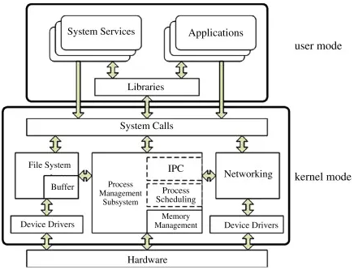
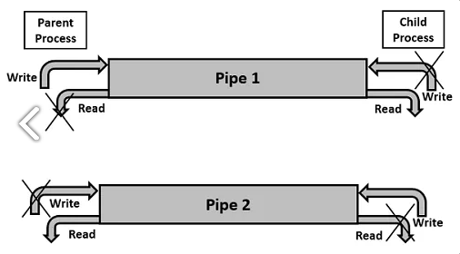
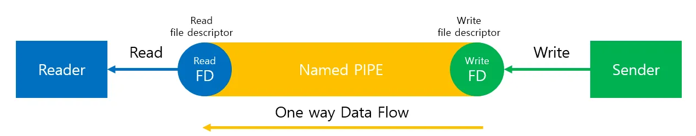
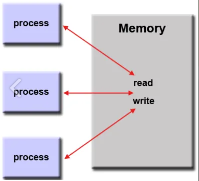

# IPC(Inter-Process Communication)

> ### IPC란?

- 프로세스들 사이에 서로 데이터를 주고받는 행위

- 위 그림처럼 우리가 사용하는 프로세스들은 모두 유저공간(user-space, user-mode)에서 OS로부터 할당받은 공간에 독립적으로 운행된다
- 서로 다른 프로세스의 주소 공간(변수, 자료구조 등)에 접근할 수 없으므로, 커널 영역(kernel-space, kernel-mode)에서 IPC를 통해 프로세스들 간에 통신을 제공한다

> ### 종류

#### PIPE (익명 파이프)

- 익명 PIPE는 두 개의 프로세스를 연결하는데 하나의 프로세스는 데이터를 쓰기만 하고, 다른 하나는 데이터를 읽기만 한다
- 한쪽 방향으로만 통신이 가능한 반이중 통신이라고도 한다
- 익명 PIPE는 통신할 프로세스를 명확히 알 수 있는 경우에 사용한다. (부모-자식 프로세스간 통신처럼)
- 장점
  - 간단하게 사용할 수 있으며, 한쪽 프로세스는 단지 읽기만 하고 다른쪽 프로세스는 쓰기만 하는 단순한 데이터 흐름을 가질 때 파이프를 사용하는 것이 효율적
- 단점
  -  전이중 통신(양방향 통신)을 위해 2개를 만들 때 구현이 복잡

#### Named PIPE 

- 이름을 가진 PIPE를 통해서 프로세스들 간에 단방향 통신을 지원
- 서로 전혀 모르는 상태의 프로세스들이 PIPE의 이름만 알면 통신이 가능
- Named PIPE 또한 읽기/쓰기가 동시에 불가능함. 따라서 전이중 통신을 위해서는 익명 파이프처럼 2개를 만들어야해서 장단점이 유사함

#### Message Queue

- FIFO 자료구조를 가지는 통신설비로 커널에서 관리
- 입출력 방식으로 보면 위의 Named PIPE와 동일
- 차이점은, Named PIPE는 데이터 흐름이라면 Message Queue는 메모리 공간이라는 점
- 어디서나 물건을 꺼낼 수 있는 컨베이어 벨트와 같다 보면 됨
- Message Queue에 쓸 데이터에 번호를 붙여서 다수의 프로세스가 동시에 데이터를 쉽게 다룰 수 있음
- 장점
  - 비동기 방식이기에 방대한 처리량이 있다면 큐에 넣은 후 나중에 처리 가능
  - 다수의 프로세스들이 큐에 메시지를 보낼 수 있고, 다수의 프로세스들이 큐로부터 메시지를 꺼낼 수 있음
  - 분산처리 및 경쟁처리 방식에 사용 가능
- 단점
  - 메시지가 정말 잘 전달되었는지 알 수 없음
  - 큐에 데이터를 넣고 나오는 과정에서 오버헤드가 발생할 수 있음
  - 데이터가 많이 쌓일수록 추가적인 메모리 자원이 필요

#### Shared Memory (공유 메모리)

- PIPE, Message Queue가 통신을 이용한 설비라면, 공유 메모리는 데이터 자체를 공유하도록 지원하는 설비
- 프로세스가 공유 메모리 할당을 커널에 요청하면, 커널은 해당 프로세스에 메모리 공간을 할당해 주게되고, 이후 어떤 프로세스건 해당 메모리영역에 접근할 수 있음
- 장점은, 공유 메모리는 모든 IPC중에 가장 빠르다
- 단점은, 커널 설정에 종속적이기에 사용하기전에 커널에서 허용하고 있는 공유메모리 사이즈를 확인해야함. 

#### Memory Map (메모리 맵)

- 메모리 맵도 공유 메모리와 마찬가지로 메모리를 공유한다는 측면에서는 비슷
- 차이점은 메모리 맵은 열린 파일을 메모리에 매핑시켜서 공유한다는 점

- 장점
  - 데이터가 메모리에 이미 올라와있는 것처럼 간단하게 접근 가능
  - 일반적인 파일 IO에 비해 나은 성능을 보여줌
  - 비동기 IO를 사용하지만 시스템에서 처리해주기 때문에 스레드 문제를 걱정할 필요가 없음
- 단점
  - 일반 파일 IO에 비해 상당히 많은 메모리 요구
  - 많은 데이터를 얼마나 오랫동안 메모리에 둘 것인지 컨트롤할 수 없음

#### Socket

- 네트워크 소켓통신을 통해 데이터를 공유한다
- 클라이언트와 서버가 소켓을 통해서 통신하는 구조로, 원격에서 프로세스간 데이터를 공유할 때 사용
- 장점
  - 서버/클라이언트 환경을 구축하는데 용이함
  - 범용적인 IPC로서 양방향 통신이 가능
  - 패킷 단위로 주고 받음으로 인해 직관적으로 이해하기 쉬운 코드를 만들 수 있음
- 단점
  - Internet UDP와는 달리 경로를 지정할 수 없음 (다중의 클라이언트를 받아들이는 서버의 경우 문제가 될 수 있음)

#### Semaphore와 Mutex

- 이 둘은, 프로세스 간 데이터를 동기화하고 보호나는데 목적이 있다
- 공유된 자원에 여러개의 프로세스(혹은 쓰레드)가 동시에 접근하면 문제가 발생하기 때문에, 이를 제어하는 방법이다
- 추가적인 정보는 [여기](https://velog.io/@conatuseus/OS-%EC%84%B8%EB%A7%88%ED%8F%AC%EC%96%B4%EC%99%80-%EB%AE%A4%ED%85%8D%EC%8A%A4) 를 참고하면 좋을것 같다

> ### 참고 자료

- [IPC, 종류 및 특징](https://www.byfuls.com/programming/read?id=63)

- [IPC](https://github.com/gyoogle/tech-interview-for-developer/blob/master/Computer%20Science/Operating%20System/IPC(Inter%20Process%20Communication).md)

- [IPC종류](https://doitnow-man.tistory.com/110)

