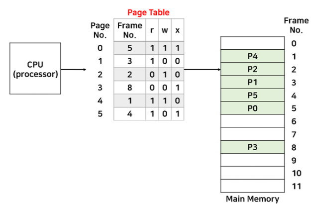

# 메모리 관리 전략

> ### 메모리 관리 배경

#### 메모리 관리 전략

- 프로그램의 크기가 계속 증가하기에 메모리는 언제나 부족
- 제한된 물리 메모리의 효율적인 사용과 메모리 참조 방식을 제공하기 위한 전략

#### 효과적인 메모리 사용

1. 동적 적재(Dynamic Loading)

   - 프로그램 실행에 반드시 필요한 루틴과 데이터만 메모리에 적재하는 방법
   - 모든 루틴(ex. 오류처리)과 데이터(ex. 배열)은 항상 사용하지 않고, 실행 시 필요하다면 해당 부분을 메모리에 적재

2. 동적 연결(Dynamic Linking)

   - 라이브러리 루틴연결을 컴파일 시점에 하는 것이 아닌 실행 시점까지 미루는 기법

3. 스와핑(Swapping)

   - 표준 스와핑 방식으로는 round-robin과 같은 스케줄링의 다중 프로그래밍 환경에서 CPU 할당 시간이 끝난 프로세스의 메모리를 보조 기억장치(ex. 하드디스크)로 내보내고 다른 프로세스의 메모리를 불러 들일 수 있음
   - 주 기억장치(RAM)으로 불러오는 과정을 swap-in, 보조 기억장치(하드디스크)로 내보내는 과정을 swap-out이라 함

   - swap에는 큰 디스크 전송시간이 필요하기에 메모리 공간이 부족할 때 swapping이 시작됨

#### 단편화(Fragmentation)

- 메모리 공간이 충분함에도 불구하고 프로세스가 메모리에 적재되지 못하여 메모리가 낭비되는 현상

​																																						[사진 출처](https://github.com/JaeYeopHan/Interview_Question_for_Beginner/tree/master/OS#%EB%A9%94%EB%AA%A8%EB%A6%AC-%EA%B4%80%EB%A6%AC-%EC%A0%84%EB%9E%B5)

1. 외부 단편화(External Fragmentation)
   - 가변 분할 방식에서 메모리에 프로세스가 적재되고 제거되는 일이 반복되면서, 여유 공간이 충분함에도 불구하고 이러한 여유 공간들이 조각으로 흩어져 있어(Scattered Holes) 메모리에 프로세스를 적재하지 못해 메모리가 낭비되는 현상
   - 가변 분할 방식: 메모리에 적재되는 프로세스 크기에 따라 분할의 크기, 개수가 동적으로 변하는 방식

2. 내부 단편화(Internal Fragmentation)
   - 고정 분할 방식에서 프로세스가 실제 사용해야할 메모리보다 더 큰 메모리를 할당받아 메모리가 낭비되는 현상
   - 고정 분할 방식 : 주어진 개수 만큼의 영구적인 분할로 미리 나누어 두고 각 분할에 하나의 프로그램을 적재하는 방식

#### 압축(Compaction)

​																																						[사진 출처](https://github.com/JaeYeopHan/Interview_Question_for_Beginner/tree/master/OS#%EB%A9%94%EB%AA%A8%EB%A6%AC-%EA%B4%80%EB%A6%AC-%EC%A0%84%EB%9E%B5)

- 외부 단편화를 해소하기 위한 방법으로 Scattered Holes를 모으는 방법
- Scattered Holes를 합치는 과정에서 메모리에 적재된 프로세스를 정지시키고 한쪽으로 이동시키는 작업이 필요하기에 비효율적
- 또한, Scattered Holes를 어느 자유공간을 기준으로 모을지 결정하는 알고리즘도 모호

> ### 페이징과 세그멘테이션

#### 페이징(Paging)

크기가 동일한 페이지로 메모리를 나누어 가상(논리) 주소 공간과 이에 매칭하는 물리 주소 공간을 관리하는 것

​																															[사진 출처](https://spacefordeveloper.tistory.com/174)

- 페이징으로 외부 단편화와 압축 작업의 비효율성을 해결할 수 있음

- 리눅스에서는 4KB로 메모리를 자른다.

- 페이지 번호를 기반으로 가상주소-물리주소 매핑 정보를 기록하고 사용

- 프로세스를 자르는 단위를 페이지라 하고, 이에 동일한 크기로 메모리를 자른 것을 프레임이라고 함

- 이때 MMU(Memory Management Unit)가 page table이 되어 가상 메모리 주소를 물리 메모리 주소로 매핑해줌

- 단점: 내부 단편화 문제의 비중이 늘어남. 예를 들어, 페이지 크기가 1,024B이고 프로세스 A가 3,172B의 메모리를 요구한다면 3개의 페이지 프레임(1,024*3 = 8,072)하고도 100B가 남기 때문에 총 4개의 페이지 프레임이 필요. 결국, 4번째 페이지 프레임에는 924B의 여유 공간이 남게 되는 내부 단편화 문제 발생

  

#### 세그멘테이션(Segmentation)

페이징과 다르게, 프로세스를 서로 크기가 다른 논리적인 블록 단위인 '세그먼트(Segment)'로 분할하고 메모리에 배치하는 것을 말함

- 단점: 외부 단편화가 발생

#### 세그멘테이션 페이징 혼용 기법(Paged Segmentation)

- 페이징과 세그멘테이션도 각각 내부 단편화와 외부 단편화 발생
- 페이징과 세그멘테이션을 혼용해 이러한 단편화를 최대한 줄이는 전략
- 프로세스를 세그먼트(논리적 기능 단위)로 나눈 다음 세그먼트를 다시 페이지 단위로 나누어 관리
- 매핑 테이블을 두번 거쳐야하므로 속도가 느려짐

