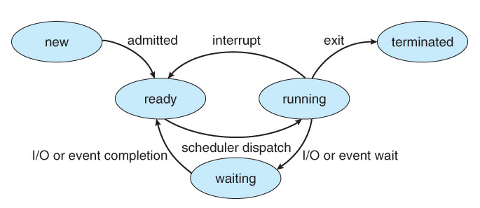
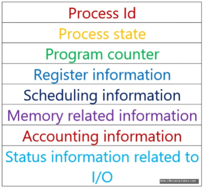

# 프로세스 상태와 PCB

### 프로세스 상태 (Process State)

#### 프로세스 상태

프로세스의 상태는 기본적으로 다음과 같이 5가지가 있다

1. 생성(create or new) 상태

   프로세스 자체는 생성되었지만 아직 프로그램이 메모리에 적재되지 않은 상태

2. 준비(ready) 상태

   - 실행된 프로세스가 메모리에 적재되고 CPU를 할당 받기 위해 준비중인 상태

   - 언제든지 수행될 수 있는 만반의 준비상태

3. 실행(running) 상태
   - 프로세스가 CPU를 할당받아서 명렬어를 실행하고 있는 상태

4. 대기(waiting or block) 상태

   - 실행상태에 있던 프로세스가 급작스런 이벤트에 의해 실행을 일시적으로 멈춘 상태

   - I/O나 다른 event가 완료되기를 기다리는 상태

5. 종료(terminated) 상태

   - 프로세스의 실행이 모두 정상적으로 끝나서 종료된 상태

   - 운영체제가 프로세스의 PCB를 제거하고 메인 메모리에서 프로세스가 빠져나간 상태

   - cf)오류나 강제 종료(abort)가 일어나면 그 이전의 메모리 상태를 저장장치로 옮기는 코어덤프(core dump)

#### 프로세스 상태 전이

프로세스의 상태는 특정한 이벤트에 의해 변화되는데 이를 프로세스의 상태 전이라고 한다

- admitted
  - 생성된 프로세스가 승인을 받아서 실행됨
- scheduler dispatch
  - 보통 dispatch라고도 하며, 준비상태에 있던 프로세스가 CPU를 할당받아서 실행되는 것
- interrupt
  - 실행 중이던 프로세스가 특정 이벤트에 의해서 다시 준비상태로 넘어가는 것
  - 프로세스가 할당된 시간에 모든 명령을 실행하지 못하여 넘어가는 Time out 등이 있음
- I/O or event wait
  - CPU가 프로세스를 실행 중에 있을 때 급작스러운 이벤트(I/O 등)에 의해서 CPU가 다른 프로세스를 할당하게 될 때 현재 실행중인 프로세스는 대기상태로 넘어가는 것과 같은 상태 전이
- I/O or event completion
  - 급작스런 이벤트(I/O 등)에 의한 CPU할당을 받은 프로세스의 실행이 끝나면 대기상태에 있던 프로세스는 다시 준비상태로 넘어가는 것과 같은 상태 전이

- exit
  - 프로세스의 모든 명령이 실행된 후에  종료되는 상황을 말함

### PCB(Process Control Block)

#### 요약

- 운영체제가 프로세스를 제어하기 위해 정보를 저장해 놓는 곳으로, 프로세스의 상태 정보를 저장하는 구조체
- 프로세스 상태 관리와 문맥교환(Context Switching)을 위해 필요
  - 위의 프로세스 상태로 예를 들면,
  - 인터럽트에 걸려서 ready 상태가 되었다가 다시 실행이 될 때, 아까 중단된 시점부터 다시 실행이 되어야 함
  - 이 때, 필요한 정보가 PCB에 있음
- PCB는 프로세스 생성 시 만들어지며 주기억장치에 유지됨

#### PCB에서 유지되는 정보

- 프로세스 식별자(Process ID): 각각의 프로세스를 식별하기 위한 고유 ID
- 프로세스의 상태(Process State): 생성, 실행, 준비, 대기, 종료 상태
- 프로그램 계수기(Program Counter): 해당 프로세스가 다음에 실행할 명령어의 주소
- CPU register와 general register
  - CPU에서 사용한 레지스터의 값을 잃지 않기 위해서 PCB에 레지스터 값을 저장하고 다시 프로세스가 호출되었을 때 사용하기 위해서 저장
- CPU 스케쥴링 정보: priority와 최종 실행시각, CPU 점유시간 등을 저장
- Memory 관리 정보 : 프로세스의 현재 주소와 주소 공간을 가지고 있음
- 프로세스 계정 정보
  - 현재 프로세스의 부모 프로세스가 어떤 것인지, 스케쥴링 큐 포인터(Ready 큐 다음에 있는 프로세스를 가리키는 포인터) 등이 있음
- I/O State 정보 : 현재 프로세스에 할당된 입출력 장치 목록과 오픈 파일 목록 등을 알려줌

### 참고자료

[프로세스 상태](https://jhnyang.tistory.com/7)

[프로세스 상태2](https://enlqn1010.tistory.com/30)

[프로세스 상태와 PCB](https://doorbw.tistory.com/26)

[PCB](https://jhnyang.tistory.com/33)

[PCB2](https://enlqn1010.tistory.com/26)