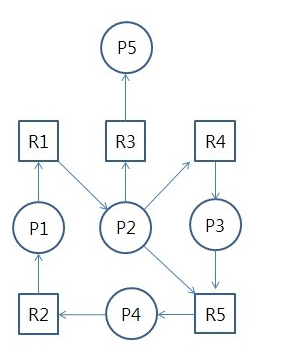

# 교착상태(DeadLock)

* 두개 이상의 프로세스에서 한정된 자원을 사용하려고 할떄 발생하는 문제
* 프로세스가 처리에 필요한 자원을 얻지 못해서 대기를 지속중인 상태
* 프로세스1이 자원1을 가지고 자원2가 필요한 상황에서 프로세스2가 자원2를 가지고 자원1이 필요해서 서로 무한정 대기를 하고 있는 상황을 말한다.

### 주로 발생하는 경우

* 위와 같은 경우처럼 여러 프로세스가 한정된 상황을 얻기위해 대기중인 상황
* 한 프로세스가 자원 요청을 했을 떄, 동시에 그 자원을 사용할 수 없는 상황이 발생시
* 이 대기 상태에 들어간 프로세스들이 실행 상태로 변경할 수 없을때 발생

### 발생에 필요한 4가지 조건

* 4가지 조건이 모두 성립할때 발생
* 교착상태를 해결하기위해 이 4가지 조건중 하나라도 성립하지 못하게하면 해결된다.
* <strong>첫번째</strong>는 상호배제로 자원을 한번에 한 프로세스만이 사용가능한 경우
* <strong>두번째</strong>는 점유대기로 하나의 자원을 점유하고 있으면서 다른 프로세스에서 할당된 자원을 점유하기위해 대기중인 경우
* <strong>세번째</strong>는 비선점, 다른 프로세스에 할당된 자원은 사용이 끝나서 반납할떄까지 강제로 빼앗을 수 없는 경우
* 마지막으로 <strong>네번째</strong>는 순환대기로, 프로세스 집합 P = {p1,p2,p3,...pn}에서 p1은 p2의 자원을, p2는 p3의 자원을 pn은 p1의 자원을 요구하는 식으로 순환 형태로 서로 자원을 요구하는 경우이다.

### 처리방법

##### 예방

* 위에 제시된 4가지 조건중에 하나를 제거하는 방식으로 해결하는것
* 다만 교착상태처리가 가능하지만 자원의 낭비가 매우 심해진다는 단점이 있다.
* 상호배제 부정 : 여러프로세스가 공유자원 사용

* 점유대기 부정 : 프로세스 실행 전, 모든 자원 할당
* 비선점 부정 : 자원 점유중인 프로세스가 다른자원 요구시 자원 반납
* 순환대기 부정 : 자원에 고유번호 할당 후 순서대로 자원 요구

##### 회피

* 교착상태 발생시 피하는 방법
* 은행원 알고리즘(Banker's Algorithm)이라고 한다.
  * 프로세스가 자원 요구시, 자원 할당 후에도 안정상태인지 검사하여 교착상태를 피하는것
  * 안정상태라면 자원할당, 아니면 다른 프로세스가 자원 해제할때까지 대기한다.

### 탐지 및 회복

* 교착상태가 되도록 허용하고 회복시키는 방법이다.

##### 탐지

* 자원 할당 그래프를 통해서 교착 상태를 탐지한다

  

  출처:https://github.com/WooVictory/Ready-For-Tech-Interview/blob/master/Operating%20System/%EA%B5%90%EC%B0%A9%EC%83%81%ED%83%9C(DeadLock).md

* 그래프 예시로 P는 프로세스 R은 자원을 의미하며 프로세스에서 자원으로 가는 화살표는 할당요구 반대로 자원에서 프로세스로 가는 화살표는 할당됨을 의미한다.
* 자원 요청시마다 그래프탐색을 하므로 오버헤드가 발생한다.

##### 회복

* 교착상태를 일으킨 프로세스를 종료하거나, 할당된 자원을 해제시킨다.

* 프로세스 종료 방법
  * 교착상태의 프로세스 모두 중지
  * 교착상태가 제거될때까지 하나씩 중지
* 자원 선점 방법
  * 교착상태의 프로세스가 점유하고 있는 자원을 선점하여 다른프로세스에게 할당, 해당 프로세스를 일시정지시킨다.
  * 우선순위가 낮은 프로세스, 수행된 횟수가 적은 프로세스 등을 위주로 자원을 선점

